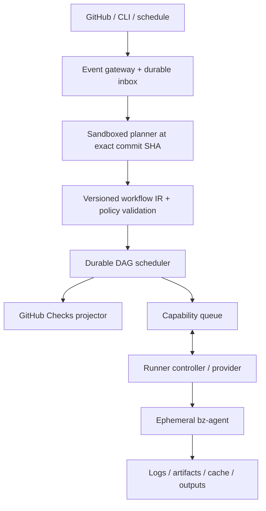
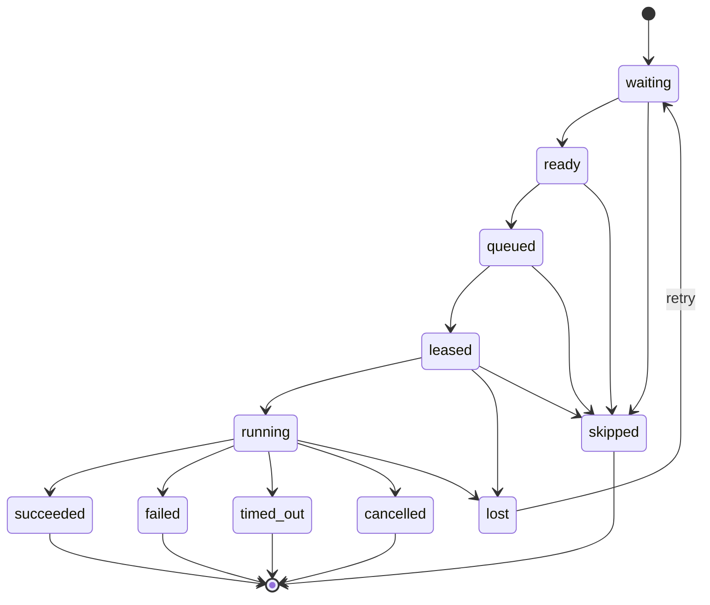

# bz CI platform roadmap

Status: proposed

Baseline: `dev/v2.0` at `65b5b2b`

Detailed implementation suite: [plans/bz-ci/README.md](bz-ci/README.md). The suite breaks this
strategy into architecture, workflow/IR, testing, GitHub integration, scheduling, runner,
infrastructure, data, security/OIDC, product/billing, SRE/DR, and issue-level delivery plans with
dependencies, schemas, failure behavior, tests, work packages, and release gates.

## Product thesis

bz CI should be a GitHub-native but GitHub Actions-independent CI service built around one
principle: workflow behavior is application code and must be testable before it is pushed.

The intended developer experience is one workflow implementation used in four modes:

1. `bz CI.verify` on a developer machine.
2. `bz test` with in-memory commands, events, secrets, outputs, and failure scenarios.
3. The existing bz GitHub Action during migration.
4. An independent bz control plane scheduling the same task on a managed or customer runner.

The product should optimize for reliable, understandable CI rather than full GitHub Actions
emulation. The initial differentiators are:

- real TypeScript rather than YAML expressions;
- unit-testable workflow behavior and edge cases;
- host-native execution, with containers available but not mandatory;
- independent durable scheduling and logs;
- provider-neutral managed or bring-your-own runners;
- gradual adoption without rewriting the existing bz task implementation.

## Scope and non-goals

### First general-availability scope

- GitHub App installation and repository selection.
- Push, pull request, merge queue, manual, API, and scheduled triggers.
- Typed, serializable job DAGs with dependencies, matrices, conditions, timeouts, retries,
  concurrency groups, and cancellation.
- Linux x64 and ARM64 jobs.
- Bring-your-own runner pools and one managed Linux runner provider.
- Live logs, annotations, summaries, artifacts, dependency caches, secrets, and audit events.
- GitHub Checks integration with rerun and cancel operations.
- Local planning, validation, simulation, and unit testing.
- Short-lived cloud identity through a bz OIDC issuer before GA.
- Service subscriptions, plan entitlements, usage billing, budgets, invoices, and cancellation.

### Explicit non-goals for the first release

- Complete compatibility with GitHub Marketplace actions or the Actions runner protocol.
- Transparent emulation of every `${{ ... }}` expression and GitHub context edge case.
- A hermetic or content-addressed build engine competitive with Dagger, Bazel, or Nix.
- Managed Windows and macOS fleets before Linux is dependable.
- Multi-cloud or active-active multi-region control-plane deployment.
- A public runner-provider marketplace before the internal provider contract stabilizes.
- Executing untrusted repository TypeScript inside a trusted control-plane service.

## Architecture boundaries



The system has five deliberately separate layers:

1. **Workflow SDK**: authoring, local execution, simulation, and a serializable job graph.
2. **Planner**: safely evaluates repository code at an exact commit and emits workflow IR.
3. **Control plane**: receives events, creates runs, schedules jobs, and owns durable state.
4. **Execution plane**: runner controllers and agents execute one fenced job attempt at a time.
5. **Integration plane**: GitHub Checks, notifications, cloud identity, and external APIs.

### Two orchestration levels

The current `$pipeline()` remains the runner-local task pipeline. It may use ordinary TypeScript
conditions and execute steps sequentially or in-process because it lives entirely inside one job.

A new `defineWorkflow()` API describes the distributed job graph. Distributed fields must be
serializable and deterministic. Arbitrary callbacks are not allowed for job dependencies,
matrices, runner requirements, permissions, or server-evaluated conditions.

```ts
export default defineWorkflow({
  on: {
    push: { branches: ['main', 'dev/**'] },
    pullRequest: {},
    manual: {}
  },
  concurrency: {
    group: expr.concat('ci-', context.ref),
    cancelInProgress: true
  },
  jobs: {
    test: job({
      matrix: {
        node: ['24.15.0', '26'],
        architecture: ['x64', 'arm64']
      },
      runner: linux({ cpu: 4, architecture: matrix.architecture }),
      timeout: minutes(20),
      task: 'CI.verify',
      vars: { node: matrix.node }
    }),
    quality: job({
      needs: ['test'],
      runner: linux({ cpu: 8 }),
      permissions: { contents: 'read', pullRequests: 'write' },
      task: 'CI.quality'
    })
  }
});
```

### Durable execution semantics

- Webhook ingestion, queue delivery, and runner assignment are at least once.
- Every external event and state transition has an idempotency key.
- A job may have multiple attempts, but only the current attempt owns a valid fencing token.
- Runner leases expire unless heartbeats renew them.
- A late or duplicated runner cannot publish outputs after its lease has been superseded.
- Automatic retry applies only when policy permits it. Jobs with external side effects are not
  silently retried.
- Cancellation is a durable desired state, not only an `AbortSignal` in one process.
- PostgreSQL is the source of truth; the delivery queue is never the authoritative record.

## Workstream 1: workflow language, IR, and test kit

### Deliverables

- Add `defineWorkflow()`, `job()`, trigger, runner, matrix, permission, environment, retry,
  timeout, service, and concurrency builders.
- Define a small typed expression AST for server-evaluated conditions and interpolated values.
- Publish a versioned JSON Schema and TypeScript types for `WorkflowPlanV1`.
- Give every workflow, job, dependency, matrix expansion, and expression a stable identifier.
- Compute a canonical plan hash from normalized IR.
- Add `bz plan --json`, `bz validate`, `bz graph`, and `bz explain <job>`.
- Add `bz simulate --event <fixture>` to expand matrices and explain scheduling decisions.
- Extend `MemoryWorkflowRuntime` with fixtures for push, pull request, fork, merge queue,
  schedule, cancellation, timeout, cache hit/miss, secret presence, and provider failure.
- Add helpers that make tests read as behavioral specifications:

  ```ts
  await expectWorkflow(CI)
    .on(pullRequest({ fork: true }))
    .withCommandResults({ lint: success(), test: failure(2) })
    .expectJob('verify')
    .toFailAt('test')
    .withoutSecret('DEPLOY_TOKEN');
  ```

- Preserve the existing `BzTasks`, `$pipeline()`, `$exec()`, lifecycle, and injection APIs.
- Establish a compatibility policy for workflow IR and agent protocol versions.

### Test gates

- The same source and event always produce byte-identical canonical IR.
- Invalid cycles, duplicate identifiers, impossible dependencies, invalid matrices, and unsafe
  permissions fail locally with source locations.
- Every expression operator has property-based and serialization round-trip tests.
- Golden tests cover all supported event types and matrix expansions.
- The local simulator and server scheduler pass the same conformance suite.

## Workstream 2: migration bridge and dogfooding

This workstream validates the authoring model before the independent service is trusted.

### Deliverables

- Keep the existing `jstty/beelzebub/github-action` adapter supported.
- Compile `WorkflowPlanV1` to a generated thin GitHub Actions workflow.
- Support GitHub-hosted and Blacksmith runner-label mappings in the generated bridge.
- Add `bz bridge check` to fail CI when generated YAML is stale.
- Add a narrow Actions importer for triggers, matrices, dependencies, permissions, `run` steps,
  and a documented set of common actions.
- Publish first-party bz modules for checkout, Node setup, artifacts, cache, Docker, GitHub API,
  and cloud authentication rather than promising arbitrary Marketplace compatibility.
- Run the beelzebub repository in dual mode: GitHub schedules both the existing workflow and the
  generated bridge, with only the existing workflow initially required.
- Compare task order, command lines, outcomes, annotations, summaries, and artifact hashes.

### Exit criteria

- At least three representative repositories use the typed job API through the bridge.
- Thirty consecutive days of dogfood runs show no unexplained semantic differences.
- A migration requires changing scheduling configuration, not rewriting bz task methods.

## Workstream 3: GitHub App and event gateway

### Deliverables

- Create a GitHub App with minimum repository permissions and explicit permission documentation.
- Verify webhook HMAC signatures before accepting payloads.
- Persist the raw delivery, headers, installation, repository, and delivery GUID before returning
  a response.
- Return `2xx` quickly and perform all planning asynchronously.
- Deduplicate deliveries by GitHub delivery GUID while retaining redelivery history.
- Handle installation lifecycle, repository access changes, pushes, pull requests, merge queues,
  check reruns, requested actions, and cancellations.
- Create queued, in-progress, and completed GitHub Check runs with details links and annotations.
- Add a projector/outbox so GitHub API failures never roll back internal run state.
- Periodically list failed GitHub App deliveries and request redelivery.
- Reconcile recently updated branches and pull requests to detect missed events.
- Add CLI and API triggers that do not require GitHub Actions.

### Initial data model

- `accounts`, `users`, `memberships`
- `github_installations`, `repositories`, `repository_permissions`
- `webhook_deliveries`, `event_inbox`
- `workflow_plans`, `workflow_plan_versions`
- `runs`, `jobs`, `job_dependencies`, `job_attempts`
- `runner_pools`, `runner_sessions`, `runner_leases`
- `check_projections`, `outbox_events`
- `log_streams`, `artifacts`, `cache_entries`
- `secret_metadata`, `environments`, `approvals`
- `usage_events`, `audit_events`

### Test gates

- Duplicating or reordering webhook deliveries never creates duplicate runs.
- Installation suspension or repository removal immediately blocks new work.
- GitHub API downtime does not prevent already accepted runs from executing.
- Check updates catch up in order when GitHub recovers.
- Fork pull request fixtures never receive protected secrets or write tokens.

## Workstream 4: sandboxed planning service

Repository TypeScript is untrusted code. Planning therefore happens as a short-lived execution
job, never as an import inside the API or scheduler process.

### Deliverables

- Fetch the exact commit using a short-lived, repository-scoped installation token.
- Bootstrap a pinned bz planner without depending on globally installed project tooling.
- Execute dependency installation only inside the planner sandbox when the workflow requires it.
- Apply CPU, memory, wall-time, process, filesystem, and output-size limits.
- Deny secrets and production network access during planning.
- Make dependency-network access an explicit repository policy.
- Emit only validated `WorkflowPlanV1`, diagnostics, dependency metadata, and a plan hash.
- Cache plans by repository, commit SHA, workflow path, bz version, lockfile hash, and policy hash.
- Sign or authenticate planner results so runner-supplied plans cannot enter the scheduler.
- Record planner version and source locations for reproducible diagnostics.

### Test gates

- Infinite loops, process forks, large output, memory exhaustion, network access, and filesystem
  escape attempts terminate without affecting control-plane services.
- The same commit and policy produce the same plan hash.
- A compromised or obsolete planner image cannot submit an unsupported IR version.

## Workstream 5: control-plane scheduler and API

### Services

- **API service**: account, repository, workflow, run, job, runner-pool, secret, and audit APIs.
- **Scheduler**: expands matrices, resolves DAG readiness, applies concurrency, and creates
  attempts.
- **Queue dispatcher**: transactionally publishes ready attempts through an outbox.
- **Lease controller**: tracks claims and heartbeats and marks abandoned attempts lost.
- **Check projector**: converts internal state to GitHub Checks updates.
- **Retention worker**: expires logs, artifacts, caches, raw webhooks, and planner bundles.
- **Reconciler**: repairs missed GitHub events and internal state/queue divergence.

### Job states



Terminal state transitions are immutable. Retry creates a new attempt rather than reopening an
old one.

### Deliverables

- PostgreSQL-backed state machines with explicit transition validation.
- Transactional outbox between state changes and queue publication.
- Capability queues based on OS, architecture, CPU, memory, virtualization, region, and pool.
- Concurrency groups with configurable cancel-in-progress behavior.
- Job priorities, fairness between tenants, quotas, and backpressure.
- Timeouts covering queue, provisioning, checkout, execution, cleanup, and total job duration.
- Manual and policy-based retries with attempt history.
- Idempotent cancel, rerun, approve, and skip operations.
- Server-sent events or WebSocket API for run state and live log cursors.
- An immutable audit trail for security-sensitive operations.

### Test gates

- Model-based tests exercise every legal and illegal job-state transition.
- Queue duplication and worker crashes do not produce two authoritative attempts.
- Scheduler restarts preserve concurrency limits and dependency decisions.
- Lease expiry reliably fences late agents.
- Large matrices enforce configured expansion and cost limits before queueing.

## Workstream 6: runner protocol and bz-agent

### Protocol

The agent uses outbound HTTPS only. The minimum protocol supports:

1. Bootstrap registration using a pool-scoped credential.
2. Exchange for a short-lived runner session.
3. Long-poll for compatible work.
4. Claim an attempt and receive a lease plus fenced attempt token.
5. Heartbeat, renew the lease, and receive cancellation.
6. Stream structured log frames and task events with monotonically increasing sequence numbers.
7. Request scoped checkout, artifact, cache, secret, and OIDC tokens.
8. Publish outputs and a terminal result.
9. Prove cleanup or report cleanup failure.

### Agent deliverables

- A signed, auto-updatable `bz-agent` with pinned protocol compatibility.
- Ephemeral workspace creation and secure cleanup.
- Exact-SHA checkout with submodule and Git LFS policies.
- Pinned bz runtime bootstrap and task-file loading.
- Process-tree cancellation, graceful termination, then forced termination.
- CPU, memory, disk, process, and wall-time enforcement where the host supports it.
- Line-safe secret masking before logs leave the machine.
- Disk-backed log buffering with resumable upload after network interruptions.
- Direct signed-URL artifact and cache transfer so large objects bypass the API service.
- Runner health, version, capacity, and drain state.
- A local Docker runner for development and protocol integration tests.
- A provider conformance suite reusable by every runner implementation.

### Bring-your-own runner modes

- **Static pool**: customer machines run `bz-agent` and claim compatible jobs.
- **Kubernetes controller**: an outbound-only controller claims work and creates one Kubernetes
  Job per attempt with a one-time token and automatic TTL cleanup.
- **Autoscaled VM pool**: a customer controller provisions one VM per attempt or uses a warm pool.

### Managed runner path

Start with one ephemeral Linux VM per job attempt. Introduce warm capacity only after queue and
provisioning metrics are understood. Firecracker or another microVM layer is a later optimization,
not a prerequisite for the first managed beta.

Do not reuse the GitHub Actions runner protocol. Add a Blacksmith adapter only if Blacksmith offers
a supported generic provisioning or partner API.

### Test gates

- Agent protocol versions have compatibility and downgrade tests.
- Killing an agent, VM, network connection, or controller at every lifecycle point produces a
  bounded and explainable result.
- No attempt token can modify a different job or a superseding attempt.
- Cleanup tests verify secrets and repository contents do not survive into the next job.

## Workstream 7: logs, artifacts, cache, secrets, and identity

### Logs

- Stream numbered, timestamped frames with stdout/stderr, group, annotation, and task event types.
- Persist immutable compressed chunks in object storage.
- Store only indexes, cursor metadata, and retention state in PostgreSQL.
- Support reconnect from the last acknowledged sequence number.
- Preserve raw logs independently of GitHub availability.
- Record masking events without retaining secret plaintext.

### Artifacts

- Upload directly to object storage through short-lived signed URLs.
- Calculate size and cryptographic digest before an artifact becomes visible.
- Enforce tenant, repository, run, and retention boundaries.
- Make immutable artifacts addressable across dependent jobs.
- Add quotas, lifecycle deletion, and malware scanning policy hooks.

### Dependency cache

- Separate cache storage and permissions from immutable artifacts.
- Support exact primary keys and ordered restore prefixes.
- Include OS and architecture in recommended cache namespaces.
- Prevent fork pull requests from writing trusted-branch caches by default.
- Add per-repository quotas, last-access eviction, integrity digests, and poison reporting.
- Do not promise transparent GitHub Actions cache compatibility.

### Secrets

- Envelope-encrypt values with a managed KMS key hierarchy.
- Scope secrets to account, repository, environment, branch/ref policy, and job.
- Resolve authorization at job start and issue only the secrets required by that job.
- Never expose protected secrets to untrusted fork pull requests.
- Mask exact values and encoded common forms while documenting masking limitations.
- Record secret identifiers and access decisions in audit events, never plaintext values.
- Support external secret providers after native semantics stabilize.

### OIDC

- Operate a bz issuer with published discovery metadata and rotating signing keys.
- Include stable claims for account, repository, commit, ref, workflow, job, attempt, environment,
  trigger actor, and runner-pool trust level.
- Issue short-lived tokens only to a currently leased attempt.
- Provide AWS, GCP, Azure, and Vault trust-policy examples.
- Allow each account to restrict audiences and claim patterns.
- Test key rotation and revocation behavior before GA.

## Workstream 8: product UI, administration, subscriptions, and billing

### User experience

- GitHub App installation and repository onboarding.
- Workflow plan, expanded graph, and explanation of why each job ran or skipped.
- Live run page with queue, provisioning, checkout, task, upload, and cleanup timings.
- Searchable logs with stable deep links.
- Rerun failed job, rerun with dependencies, cancel, and manual workflow dispatch.
- Artifacts, cache usage, annotations, summaries, and runner metrics.
- Clear diagnostics when no runner capability matches a queued job.
- CLI parity for core inspection and control operations.

### Administration

- Account roles, repository access synchronization, runner pools, quotas, and retention.
- Environment protection rules and manual approvals.
- Secret and OIDC policy management.
- Audit-log export and deletion workflows.
- Usage budgets and alerts before work is rejected.

### Service subscriptions

- Versioned Free/developer, Team, and Enterprise-style product/price catalog without hard-coded
  scheduler checks.
- Hosted checkout and billing portal, trials, upgrades, scheduled downgrades, cancellation,
  payment-recovery grace periods, suspension, and resumption.
- Durable entitlement snapshots enforced locally by the API, scheduler, retention workers, and
  runner capacity manager.
- Signed, idempotent payment-provider webhooks plus periodic reconciliation.
- Customer-visible subscription, effective entitlements, invoices, credits, and payment state.
- Enterprise contract overrides through the same audited entitlement model.

### Metering and billing

- Emit append-only usage events for runner seconds, CPU/memory class, storage bytes, transfer,
  planner time, and retained logs.
- Keep metering independent from mutable job rows.
- Reconcile provider invoices against internal usage.
- Support BYOC platform pricing separately from managed compute pricing.
- Add hard budget ceilings and fail-closed behavior for billing ambiguity.

## Reference infrastructure topology

The first SaaS control plane should use one cloud and one multi-availability-zone region. The
interfaces remain portable, but multi-cloud infrastructure is not an MVP requirement.

### Suggested AWS deployment

| Concern | Initial service |
| --- | --- |
| DNS and TLS | Route 53 plus ACM |
| Edge protection | WAF and an application load balancer |
| Stateless services | ECS/Fargate containers |
| Durable state | Multi-AZ RDS PostgreSQL |
| Delivery queues | SQS queues with dead-letter queues |
| Object data | Versioned S3 buckets with lifecycle policies |
| Key management | KMS |
| Service configuration | Secrets Manager or Parameter Store |
| Metrics and traces | OpenTelemetry into CloudWatch/Grafana or a managed vendor |
| Infrastructure as code | OpenTofu or Terraform |

Use separate queues for planning, capability-based job dispatch, GitHub projections, retention,
and reconciliation. SQS is delivery infrastructure only; leases and authoritative attempt state
remain in PostgreSQL.

Redis is not required initially. Add it only when measured needs justify a live-log fanout cache,
rate limiter, or short-lived coordination layer.

Kubernetes is not required for control-plane services. It remains valuable for BYOC runner pools,
where Kubernetes Jobs naturally represent isolated run-to-completion attempts.

### Network and account boundaries

- Run production, staging, and security/log archives in separate cloud accounts.
- Keep PostgreSQL, internal services, and KMS endpoints in private subnets.
- Permit runners to call only public runner APIs and signed object-storage endpoints.
- Never route untrusted planner or runner traffic into the control-plane VPC.
- Use separate buckets, KMS contexts, IAM roles, and prefixes for each environment.
- Deny public object access and require short-lived signed URLs.
- Back up PostgreSQL with point-in-time recovery and regularly test restoration.

### Deployment and schema changes

- Build signed images with SBOMs and provenance.
- Deploy stateless services through canary or blue/green releases.
- Use backward-compatible expand/migrate/contract database changes.
- Keep at least one prior agent protocol and workflow IR version supported during upgrades.
- Run database restore, queue replay, and agent downgrade drills before GA.

## Security program

The principal security boundary is between trusted control-plane code and untrusted repository
code.

### Required controls

- Threat-model planning, execution, artifact/cache access, fork PRs, and runner registration.
- Isolate managed tenants by VM or microVM per attempt; do not rely on a process boundary.
- Give planners no customer secrets and runners only job-scoped, short-lived credentials.
- Fence all writes by account, job, attempt, and lease.
- Apply least privilege to GitHub App installations and generated checkout tokens.
- Sign agent releases and verify them during managed provisioning.
- Scan service and runner images and maintain an incident-response update path.
- Encrypt data in transit and at rest and document retention/deletion guarantees.
- Perform an external penetration test before managed multi-tenant runners become generally
  available.
- Pursue formal compliance only after core isolation and auditability are demonstrably stable.

## Test strategy: CI for the CI system

Testing is a product capability and a platform release gate.

### Test layers

| Layer | Purpose |
| --- | --- |
| SDK unit tests | Tasks, hooks, conditions, events, outputs, and failure behavior |
| IR golden/property tests | Determinism, schemas, expressions, matrices, and compatibility |
| State-machine model tests | Scheduler, retries, dependencies, leases, and cancellation |
| Protocol contract tests | All agent and service versions and invalid messages |
| Service integration tests | PostgreSQL, queue, object storage, KMS, and GitHub adapters |
| Provider conformance tests | Static, Kubernetes, customer VM, and managed runner pools |
| End-to-end tests | Real GitHub App installation through completed Check run |
| Failure-injection tests | Crashes, duplication, delay, partition, throttling, and corruption |
| Upgrade tests | Database, IR, protocol, agent, rollback, and restore compatibility |

### Mandatory failure scenarios

| Fault | Expected behavior |
| --- | --- |
| Duplicate webhook | One logical run; delivery history retained |
| Missed webhook | Reconciliation or redelivery creates the run once |
| Planner crash | Bounded retry; no duplicate Check run |
| Duplicate queue message | One fenced attempt owns execution |
| Scheduler restart | DAG and concurrency decisions resume from PostgreSQL |
| Agent disconnect | Logs resume or lease expires and attempt becomes lost |
| Late old agent | Fenced from outputs, artifacts, and terminal status |
| Cancel during checkout/task/upload | Bounded termination and explicit cleanup result |
| GitHub API outage | Internal run continues; Checks update later |
| Object-store outage | Upload retries are bounded and visible; terminal policy is explicit |
| Database failover | No acknowledged run or terminal transition is lost |
| Fork PR requesting secret | Secret denied and denial is auditable |
| Cache corruption | Digest failure causes miss/quarantine, not execution with bad data |
| Old agent version | Upgrade, compatible execution, or clear refusal before claim |

### Dogfood and cutover policy

Dogfooding starts with the first minimal workflow slice and advances per job; it does not wait for a
complete milestone or service.

```mermaid
flowchart LR
  baseline[Capture current CI fixtures] --> local[Test one real job locally]
  local --> bridgeShadow[Generated bridge job, non-required]
  bridgeShadow --> bridgeRequired[Generated bridge job, required]
  bridgeRequired --> plannerShadow[Native planner shadow]
  plannerShadow --> runnerShadow[Static runner job, non-required]
  runnerShadow --> nativeRequired[Native low-risk job, required]
  nativeRequired --> nativeNonRelease[Native non-release CI]
  nativeNonRelease --> nativeRelease[Native release authority]
```



1. In M0, inventory beelzebub's actual checks, events, commands, permissions, secrets, outputs,
   artifacts, timings, required-check configuration, and fallback procedure as committed fixtures.
2. In the first M1 IR slice, model and scenario-test the real formatting job. Build its thin bridge
   emitter immediately instead of waiting for the full language surface.
3. Dual-run that generated job under a distinct non-required Check, compare semantic command trace,
   outcome, outputs, annotations, summary, and artifacts, then make it required after its parity and
   fallback gate passes.
4. Move lint, typecheck, tests, build, package, docs, and audit through the generated bridge one job
   at a time. GitHub-hosted, Blacksmith, or custom runners can remain the execution provider.
5. Shadow-plan every repository event through the native planner before it creates runs or Checks.
6. Execute formatting and lint through a fenced static runner as non-required bz Checks and use the
   live UI/CLI for diagnosis before making one low-risk Check required.
7. Move non-release jobs through BYOC and managed runners only after each job's cache, artifact,
   isolation, capacity, and recovery evidence passes.
8. Move publish/deploy/release last, after 30-day SLO evidence plus restore, GitHub outage, key
   rotation, approval, OIDC, and rollback drills.
9. The authoritative dogfood lane consumes the last promoted bz version; candidate code runs in a
   shadow lane so a broken commit cannot prevent its corrective PR.
10. Keep the last-known-good generated workflow, immutable tool pins, exact required-Check restore
    procedure, and a manually dispatchable GitHub fallback through private beta and early GA.

Every promotion has a per-job record and named rollback owner. A milestone cannot pass if its
promised dogfood stage is not active on the default branch. The detailed DF0–DF9 gates are in the
[delivery program](bz-ci/13-delivery-program.md#dogfood-first-delivery-lane).

## Reliability targets

These are design targets, not current claims.

| Measure | Private beta target | GA target |
| --- | ---: | ---: |
| Durable webhook acknowledgement | p99 under 2 seconds | p99 under 1 second |
| Accepted event loss | 0 known events | 0 known events |
| Ready-job scheduling latency | p95 under 5 seconds | p95 under 2 seconds |
| Live-log delay | p95 under 3 seconds | p95 under 2 seconds |
| Lost-runner detection | under 2 minutes | under 60 seconds |
| Control-plane availability | 99.9% | 99.95% |
| GitHub reconciliation lag | under 15 minutes | under 5 minutes |
| PostgreSQL committed-state RPO | 0 | 0 |
| Regional restore RTO | under 4 hours | under 1 hour |

Provisioning time is measured separately from scheduler latency because it depends on runner
provider and requested capabilities.

## Milestones and sequencing

Durations are rough estimates for a focused team and should be revised after the first two design
milestones.

### Milestone 0: product and protocol contracts — 2 to 3 weeks

- Approve product scope, non-goals, security boundaries, and initial cloud.
- Write ADRs for workflow IR, queue semantics, planner sandbox, runner leases, and storage.
- Define `WorkflowPlanV1`, job states, attempt fencing, and protocol versioning.
- Create threat model and service-level objectives.
- Commit DF0 fixtures and a parity manifest for the repository's current real CI.

Exit: the team can explain which code is trusted, where every durable fact lives, and how every
job reaches one terminal state.

### Milestone 1: typed workflow plan and simulator — 5 to 8 weeks

- Ship `defineWorkflow()`, expressions, matrices, dependencies, runner capabilities, and IR.
- Ship planning, validation, graph, explain, and event simulation commands.
- Expand the in-memory test kit and publish testing documentation.
- Model and scenario-test the real formatting job locally from the first minimal IR slice.
- Start its generated bridge Check as non-required without waiting for the full M1 feature set.

Exit: complex CI topology and edge cases can be validated without GitHub or subprocesses, while
the first real generated job is collecting parity on repository events.

### Milestone 2: GitHub bridge — 4 to 6 weeks

- Generate thin GitHub workflows from the IR.
- Run through GitHub-hosted and Blacksmith labels.
- Add semantic comparison and job-by-job shadow dogfooding.
- Make formatting required after its DF3 gate, then migrate the remaining non-release jobs in risk
  order with individual rollback evidence.
- Test migration against at least three repositories.

Exit: users can adopt the new language without trusting a new control plane.

### Milestone 3: independent vertical slice — 8 to 12 weeks

- GitHub App, durable webhook inbox, planner sandbox, PostgreSQL scheduler, queue, Check runs.
- Minimal agent protocol, local Docker runner, live logs, cancellation, and terminal status.
- Manual/API trigger and basic run UI.
- Shadow-plan every beelzebub event and execute at least one real low-risk job through the static
  runner as a distinct non-required Check.

Exit: a push creates and completes a bz Check without invoking GitHub Actions.

### Milestone 4: BYOC private alpha — 6 to 10 weeks

- Static agents and Kubernetes runner controller.
- Artifacts, dependency cache, native secrets, runner pools, quotas, and audit events.
- Fork PR security, lease recovery, provider conformance, and failure injection.
- Invite a small set of design partners.
- Promote one low-risk native beelzebub Check to required after DF7 and expand native jobs only by
  per-job evidence.

Exit: selected repositories can use bz as a non-required daily CI check on customer compute.

### Milestone 5: managed Linux private beta — 10 to 14 weeks

- Ephemeral x64 and ARM64 managed VMs, autoscaling, cleanup verification, and usage metering.
- Environment protection, approvals, schedules, notifications, and better migration tooling.
- Backup/restore, regional outage, security, and upgrade drills.
- Run the supported beelzebub non-release topology natively through DF8 while retaining protected
  releases on the bridge.

Exit: bz is required on low-risk repositories and meets beta reliability targets for 30 days.

### Milestone 6: GA hardening — 10 to 16 weeks

- bz OIDC issuer and cloud-provider guidance.
- Billing, budgets, support tooling, retention controls, deletion, and audit export.
- External security assessment and remediation.
- GA SLO dashboards, incident response, capacity planning, and public status page.
- Dual-run and promote beelzebub publish/deploy/release authority only through the DF9 security,
  SLO, restore, outage, and fallback gate.

Exit: managed Linux and BYOC modes meet GA gates and have a tested GitHub Actions fallback.

### Post-GA candidates

- Managed Windows and macOS runners.
- Enterprise self-hosted control plane.
- Additional source-control providers.
- External secret managers and private networking.
- Test splitting, flaky-test analytics, and affected-work discovery.
- Reusable organization workflow policies and signed workflow modules.
- A supported provider SDK and additional managed-compute partnerships.
- Carefully scoped JavaScript, Docker, or composite action compatibility.

## Team and schedule

A credible path to managed Linux GA is approximately 12 to 18 months with 5 to 7 experienced
people, assuming parallel work after the IR contract stabilizes:

- 2 engineers on workflow SDK, planner, and migration tooling;
- 2 engineers on scheduler, GitHub App, data, and API;
- 2 engineers on agent, runner controllers, isolation, and managed compute;
- 1 product/frontend engineer shared across onboarding, run UI, and administration;
- dedicated security/SRE review beginning before the BYOC alpha.

A team of 2 to 3 should target the GitHub bridge and BYOC alpha first; a secure managed
multi-tenant runner service would likely extend the schedule beyond 18 months.

## Decision log required before implementation

1. Is the control plane SaaS-only, open source, or eventually self-hostable?
2. Is TypeScript the only workflow language or the first SDK over a language-neutral IR?
3. Which expression operations are permitted in the distributed job graph?
4. Is AWS the first production cloud?
5. Does the first alpha use static BYOC agents, Kubernetes, or both?
6. What runner isolation boundary is required for managed beta?
7. Which GitHub events and merge-queue semantics define v1 compatibility?
8. Which common Marketplace actions receive first-party bz replacements?
9. Which secrets and cache behaviors are safe for fork pull requests?
10. What portions of usage and runner telemetry may leave customer infrastructure?
11. Which payment provider, plan model, trial policy, and subscription grace behavior ship first?

## Immediate implementation backlog

1. Inventory the repository's current CI jobs, scripts, events, permissions, required Checks,
   secrets, outputs, artifacts, timing, runner labels, and rollback path as DF0 fixtures.
2. Write the minimal `WorkflowPlanV1` RFC/JSON Schema needed to model the real formatting job.
3. Add a `defineWorkflow()` proof of concept next to the current `BzTasks` API and snapshot that
   job's plan for push, PR, fork, cancellation, success, and failure.
4. Add deterministic `bz plan --json`, simulation, explanation, and golden tests.
5. Extend `MemoryWorkflowRuntime` with the real event, permission, and failure fixtures.
6. Build the one-job GitHub emitter and launch its distinct non-required Check immediately.
7. Add correlated parity reporting and rehearse the last-known-good workflow/required-Check fallback.
8. Build a scheduler simulator that consumes only the IR and shares those fixtures.
9. Expand bridge generation job by job through lint, typecheck, tests, build, and package.
10. Specify the run, job, attempt, lease, and cancellation state machines.
11. Write the planner/runner threat model and fork PR policy.
12. Prototype the fenced lease protocol with an in-memory service and local static/Docker agent,
    then execute the first native non-required formatting Check.

## References

- GitHub recommends validating webhook secrets, responding within ten seconds, processing
  asynchronously, deduplicating with `X-GitHub-Delivery`, and redelivering failures:
  <https://docs.github.com/en/webhooks/using-webhooks/best-practices-for-using-webhooks>
- GitHub does not automatically redeliver failed webhooks, so the control plane needs an explicit
  redelivery/reconciliation worker:
  <https://docs.github.com/en/webhooks/using-webhooks/handling-failed-webhook-deliveries>
- GitHub Checks supports external CI status, annotations, details links, and rerun actions:
  <https://docs.github.com/en/rest/guides/using-the-rest-api-to-interact-with-checks>
- SQS uses at-least-once delivery and visibility timeouts; duplicates and lease recovery must be
  part of the scheduler design:
  <https://docs.aws.amazon.com/AWSSimpleQueueService/latest/SQSDeveloperGuide/sqs-visibility-timeout.html>
- Kubernetes Jobs represent run-to-completion work and support TTL cleanup, making them a useful
  BYOC runner primitive:
  <https://kubernetes.io/docs/concepts/workloads/controllers/job/>
