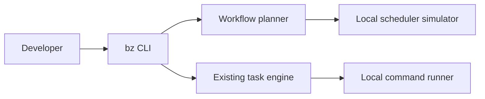
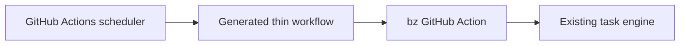
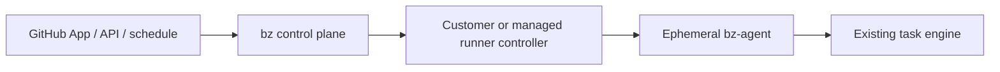
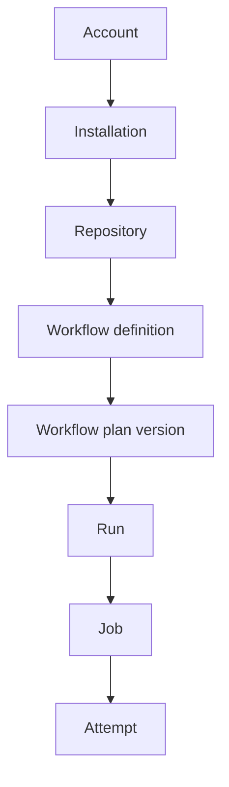
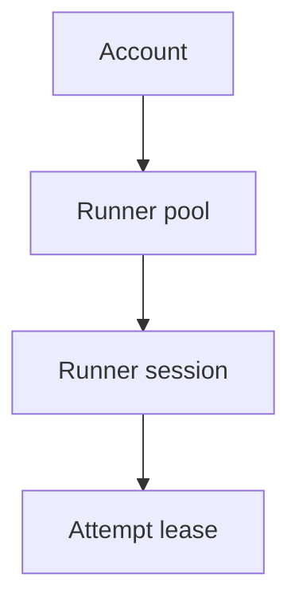

# System architecture and foundations

## Outcome

Establish the contracts and trust boundaries that let the workflow SDK, control plane, and runner
plane evolve independently without creating incompatible schedulers or unsafe execution paths.

## Inputs from v2

The current branch already provides:

- `BzTasks`, task discovery, task lifecycle, sequence, parallel, and `$pipeline()`;
- `CommandRunner` with timeout and abort support;
- `WorkflowRuntime` plus local, memory, and GitHub implementations;
- task execution records and pipeline step outcomes;
- a GitHub Action that runs installed project task files.

These remain the runner-local execution foundation. The platform work adds a distributed job
layer around them.

## System contexts

### Local-only context



Local planning and testing require no account, network connection, or service token.

### GitHub bridge context



This path validates semantics and provides migration while GitHub remains the scheduler.

### Independent SaaS context



GitHub is an event source and status surface. It is not the workflow scheduler or log store.

## Trust zones

| Zone | Trusted code | Untrusted data/code | Credentials allowed |
| --- | --- | --- | --- |
| Public edge | Event gateway | HTTP input and webhook payloads | Webhook verification secret only |
| Control plane | bz services | Validated external data | Database, queue, KMS, GitHub App credentials |
| Planner | Pinned planner image | Repository and dependency code | Short checkout token; no customer secrets |
| BYOC runner | Customer agent/controller | Repository job code | One attempt token and authorized job secrets |
| Managed runner | Signed bz image and agent | Repository job code | One attempt token and authorized job secrets |
| Object store | Cloud service | Logs, artifacts, cache payloads | Scoped service roles and signed URLs |

No connection originating in an untrusted zone may directly access PostgreSQL, internal queues,
KMS administration, or GitHub App private keys.

## Service boundaries and ownership

### Event gateway

Owns:

- raw request-size and rate limits;
- GitHub HMAC verification;
- delivery header parsing;
- durable inbox insertion;
- fast acknowledgement.

Does not own workflow selection, planning, run creation, or Check updates.

### API service

Owns:

- user and service authentication;
- account/repository authorization;
- resource reads and user-requested commands;
- idempotency for public mutations;
- SSE or WebSocket authorization.

Does not directly execute scheduler transitions outside the shared domain layer.

### Planner controller

Owns:

- planner attempt creation;
- exact-SHA source preparation;
- planner sandbox lifecycle;
- IR validation, canonicalization, and storage;
- planner diagnostic publication.

Does not trust an IR merely because a runner uploaded it.

### Scheduler

Owns:

- workflow run creation from a validated plan and event;
- matrix expansion;
- job dependency readiness;
- conditions, concurrency, quotas, approvals, retry, and terminal run calculation;
- creation of job attempts.

Does not talk to runner machines or GitHub directly.

### Dispatcher and lease controller

Own:

- publishing ready attempts to capability queues;
- runner sessions, claims, leases, heartbeats, and fencing;
- cancellation delivery and lease expiry.

Do not redefine job readiness or retry policy.

### Log gateway

Owns:

- ordered log/event ingestion;
- acknowledgement cursors;
- immutable chunk storage;
- live authorized fanout.

Does not accept an event without a valid attempt lease.

### Check projector

Owns:

- mapping internal run/job state to GitHub Check runs;
- annotation batching and limits;
- GitHub retry and rate-limit handling;
- rerun/cancel requested-action projection.

GitHub state is a projection, never the internal source of truth.

## Communication model

### Synchronous operations

Use synchronous request/response only when the caller needs an immediate bounded result:

- API reads and validated user commands;
- runner registration and token exchange;
- attempt claim and heartbeat;
- signed URL and OIDC token issuance;
- log-frame acknowledgement.

### Asynchronous operations

Use durable work items for:

- event processing;
- planning;
- ready-attempt dispatch;
- GitHub Check updates;
- retention and deletion;
- reconciliation;
- notifications and usage aggregation.

Every asynchronous handler must be idempotent. Poison messages move to a dead-letter queue and
create an operator-visible incident; they are not discarded.

## Durable event contract

Every domain event envelope contains:

```ts
interface DomainEvent<TType extends string, TPayload> {
  eventId: string;
  type: TType;
  version: number;
  occurredAt: string;
  recordedAt: string;
  accountId: string;
  aggregateType: string;
  aggregateId: string;
  causationId?: string;
  correlationId: string;
  actor: {
    kind: 'github' | 'user' | 'service' | 'runner';
    id: string;
  };
  payload: TPayload;
}
```

Required event families:

- `github.delivery.accepted`
- `workflow.plan.requested|completed|failed`
- `run.created|started|cancel_requested|completed`
- `job.waiting|ready|skipped|completed`
- `attempt.created|queued|leased|started|cancel_requested|completed|lost`
- `runner.registered|online|draining|offline`
- `artifact.created|finalized|expired`
- `cache.saved|restored|quarantined|expired`
- `secret.access_granted|access_denied`
- `check.projection_requested|completed|failed`
- `usage.recorded`

The database may store domain events for audit and integration without requiring full event
sourcing. Current state remains materialized in normalized tables.

## Identity model

Use opaque UUID or UUIDv7 identifiers internally. Store provider identifiers separately.

Hierarchy:



Runner hierarchy:



Objects never change account ownership. Repository transfer creates an explicit reconciliation and
authorization event.

## Configuration hierarchy

Precedence from lowest to highest:

1. Platform safe defaults.
2. Account policy.
3. Repository policy.
4. Workflow declaration.
5. Environment policy.
6. Authorized manual override.

Higher precedence may narrow permissions or increase isolation. It may not bypass platform safety
limits. The effective configuration and its policy hash are stored with every plan and run.

## Versioning strategy

### Workflow IR

- Major version changes represent incompatible semantics.
- Minor additions are ignored only when explicitly marked optional.
- The service accepts current and previous major versions during migration.
- The planner records its implementation version and supported IR versions.

### Agent protocol

- Registration negotiates protocol and feature capabilities.
- A runner claims only attempts whose required features it supports.
- Critical security upgrades may set a minimum accepted agent version.
- Drain obsolete agents rather than killing active compatible attempts.

### Public API

- Start under `/v1`.
- Prefer additive response changes.
- Mutations require idempotency keys.
- Deprecations publish dates, replacement behavior, and observed usage.

## Initial ADR backlog

| ADR | Decision required | Blocks |
| --- | --- | --- |
| 001 | Monorepo package/service layout | All implementation |
| 002 | Workflow IR and expression semantics | SDK, planner, scheduler |
| 003 | PostgreSQL plus outbox and SQS delivery model | Control plane |
| 004 | Planner sandbox technology | Planner alpha |
| 005 | Runner token, lease, and fencing scheme | Agent and scheduler |
| 006 | BYOC registration and network model | BYOC alpha |
| 007 | Managed job isolation boundary | Managed beta |
| 008 | Log framing, ordering, and storage | Agent, logs, UI |
| 009 | Artifact and cache integrity model | Data services |
| 010 | Secret policy and fork trust states | Secrets, GitHub events |
| 011 | OIDC issuer claims and key management | GA identity |
| 012 | SaaS tenancy and regional data placement | Infrastructure |
| 013 | Public API authentication | CLI, UI, integrations |
| 014 | Billing units and usage-event authority | Managed beta |

Each ADR includes context, considered alternatives, decision, security implications, operational
implications, migration, and rollback.

## Foundation implementation steps

### Step 1: establish workspace boundaries

1. Introduce workspace tooling without changing published v2 exports.
2. Move or wrap current modules only after package compatibility tests exist.
3. Publish internal packages privately until their APIs stabilize.
4. Add dependency-boundary lint rules so services cannot import another service's persistence
   layer.
5. Add a single version source for IR and protocol packages.

Exit criteria:

- Existing ESM, CommonJS, CLI, GitHub Action, and test-package gates remain green.
- The current package can run a task without any platform service package installed.

### Step 2: create shared domain primitives

1. Define opaque identifiers, timestamps, result/conclusion types, actor types, and error codes.
2. Define serialization rules for dates, byte sizes, durations, and hashes.
3. Define stable error envelopes with user-safe and operator-only detail.
4. Add correlation and causation identifiers to service boundaries.
5. Add schema validation for every external and queued message.

Exit criteria:

- Invalid message fuzz tests fail closed.
- Domain types contain no database, queue, HTTP, or GitHub SDK dependency.

### Step 3: create local service harness

1. Start PostgreSQL, queue emulator or compatible broker, S3-compatible object store, and fake
   GitHub API from one command.
2. Apply migrations and seed one account, repository, runner pool, and event fixture.
3. Start API, gateway, scheduler, dispatcher, lease controller, and log gateway.
4. Run one synthetic attempt through a local agent.
5. Tear down without leaving processes or credentials.

Exit criteria:

- A clean checkout reaches a synthetic completed run in under ten minutes.
- The harness runs in CI and exposes service logs and traces on failure.

## Architecture verification

Before milestone 1 begins, review this checklist:

- Every durable fact has one owning table/service.
- Every queue consumer has an idempotency rule and dead-letter behavior.
- Every untrusted-code execution has resource and network boundaries.
- Every credential has issuer, audience, subject, lifetime, and revocation behavior.
- Every public state change has an audit event.
- Every service can be upgraded without simultaneously upgrading all agents.
- Every GitHub dependency has degraded behavior and reconciliation.
- Every proposed managed runner boundary has an explicit threat model.

## Definition of done

- All required ADRs for milestone 1 are accepted.
- Package and service boundaries are represented in the repository.
- Shared schemas and domain events have compatibility tests.
- The local service harness completes one synthetic job.
- Threat zones and credential flows have an initial security review.
- Existing v2 package behavior and release gates have not regressed.
