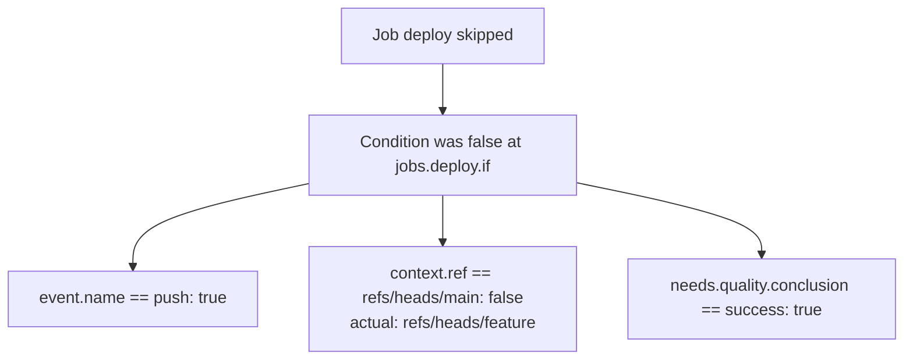

# Testing and simulation

## Outcome

Make CI changes provable before push. A workflow author must be able to test event filters,
matrices, commands, failures, cancellation, permissions, secrets, artifacts, caches, summaries,
and downstream scheduling without GitHub, a cloud account, or real subprocesses.

## Product principles

1. Tests execute the same task and condition code used by real jobs.
2. Tests replace side effects at defined interfaces rather than monkey-patching globals.
3. A scenario explains why work ran, skipped, failed, retried, or was denied.
4. Fixtures never contain production credentials.
5. Server scheduler tests and user simulator tests share semantic conformance vectors.
6. Snapshot testing supplements behavioral assertions; it does not replace them.

## Package surface

Extend `beelzebub/testing` with:

```ts
import {
  event,
  expectWorkflow,
  fakeArtifactStore,
  fakeCache,
  fakeClock,
  fakeCommand,
  fakeSecrets,
  simulateWorkflow
} from 'beelzebub/testing';
```

The test kit must work with Vitest, Jest, Node test, or another runner. Core behavior cannot depend
on Vitest globals.

## Test layers available to users

### Task unit test

Tests one `BzTasks` class with injected commands and workflow runtime.

```ts
const command = new MemoryCommandRunner().expect('npm', ['run', 'lint']).succeed();
const runtime = new MemoryWorkflowRuntime(event.pullRequest());
const app = bz.create({ commandRunner: command, workflow: runtime });
app.add(CI);

await app.run('CI.lint');

command.verifyComplete();
expect(runtime.annotations).toEqual([]);
```

### Pipeline behavior test

Tests runner-local `$pipeline()` conditions and cleanup using named command outcomes.

### Workflow plan test

Plans `defineWorkflow()` and asserts triggers, expanded jobs, permissions, dependencies, and
runner requirements.

### Full simulation

Combines a planned job graph with fake runner-local execution results and schedules dependencies,
retries, cancellation, and concurrency through the same semantic model as the service.

### Protocol/provider conformance

Reserved for bz agent and provider implementers; verifies runner behavior independent of a live
SaaS account.

## Event fixture catalog

### Common context

Every event builder supplies typed defaults for:

- event name and action;
- delivery ID;
- repository ID, owner, name, visibility, and default branch;
- commit SHA and ref;
- actor ID, login, and type;
- installation ID;
- timestamp;
- changed files when relevant;
- trust classification.

### Push fixtures

- branch creation/update/deletion;
- tag creation/update/deletion;
- default and non-default branches;
- zero, one, or many commits;
- changed-path sets;
- forced push.

### Pull request fixtures

- same-repository branch;
- fork branch;
- opened, synchronize, reopened, ready-for-review, converted-to-draft, closed;
- merged and unmerged close;
- base-branch changes;
- changed paths;
- Dependabot and automation actors;
- maintainer approval state;
- private and public repositories.

### Merge queue fixtures

- merge group created/destroyed;
- one or multiple pull requests;
- base ref and synthetic merge SHA;
- superseded merge group.

### Other fixtures

- schedule including missed-run metadata;
- manual inputs;
- API actor and idempotency key;
- rerun and requested action;
- environment approval granted/denied/expired;
- cancellation before and during execution.

Builders expose safe customization without requiring users to reproduce entire provider payloads.
Raw GitHub payload fixtures remain available for adapter tests.

## MemoryCommandRunner expansion

The current queued succeed/fail behavior becomes a strict command expectation engine.

```ts
runner
  .expect('npm', ['ci'], { cwd: '/workspace' })
  .stdout('installed\n')
  .succeed()
  .expect('npm', ['test'])
  .stderr('failing test\n')
  .exit(1, { after: milliseconds(250) });
```

Required behaviors:

- exact, partial, predicate, and unordered environment matching;
- cwd, stdin, timeout, shell, and accepted-exit-code assertions;
- scheduled stdout/stderr frames;
- signal and abort behavior;
- spawn failure;
- process-tree cleanup result;
- captured calls and verification that no expected call remains;
- strict mode that fails unexpected commands immediately;
- permissive spy mode for exploratory tests.

Command fixtures may be named so workflow simulations map a job/task to a reusable outcome.

## MemoryWorkflowRuntime expansion

Record and assert:

- provider-neutral context;
- annotations with locations;
- grouped logs;
- masked-secret registrations;
- outputs and output-size failures;
- environment variables and path changes;
- state values;
- summary writes and overwrites;
- artifact upload/download declarations and content digests;
- cache restore/save calls and hit/miss/corruption;
- secret availability and denied access;
- OIDC requests and claims;
- cancellation and deadline state;
- audit-relevant operations.

The runtime must return fake values only when configured. Unexpected secret, artifact, cache, or
identity access fails in strict mode.

## Workflow simulator

### Inputs

```ts
interface SimulationInput {
  plan: WorkflowPlanV1;
  event: SimulatedEvent;
  accountPolicy?: SimulatedPolicy;
  repositoryPolicy?: SimulatedPolicy;
  availableRunnerPools?: SimulatedRunnerPool[];
  secrets?: SimulatedSecretCatalog;
  caches?: SimulatedCacheCatalog;
  priorRuns?: SimulatedPriorRun[];
  clock?: SimulatedClock;
  outcomes?: SimulatedOutcomeResolver;
}
```

### Phases

1. Match event against workflow triggers.
2. Resolve inputs and effective policy.
3. Expand and validate matrices.
4. Create initial waiting jobs.
5. Evaluate dependencies and conditions.
6. Match ready jobs to runner capabilities.
7. Apply configured fake execution result.
8. Resolve outputs, retries, fail-fast, and cancellation.
9. Continue until every job is terminal or a deadlock diagnostic is produced.
10. Calculate run conclusion and explanation.

### Output

```ts
interface SimulationResult {
  matched: boolean;
  run?: SimulatedRun;
  timeline: SimulationEvent[];
  diagnostics: PlanDiagnostic[];
  explanation: ExplanationTree;
  estimatedUsage: ResourceEstimate;
}
```

The timeline uses a fake deterministic clock. No test depends on wall-clock sleeps.

## Assertion DSL

Required high-level assertions:

- workflow matched/did not match;
- job exists with matrix values;
- job ran, skipped, failed, cancelled, timed out, or retried;
- job depended on an exact set;
- job requested an exact effective permission set;
- job matched a runner pool or remained unmatched for a stated reason;
- command ran with exact args and safe environment subset;
- secret was available, denied, or never requested;
- cache hit/miss/save/quarantine;
- artifact digest and dependency visibility;
- annotation and summary content;
- run conclusion and estimated usage;
- explanation contains a particular decision path.

Failure messages include the actual timeline and closest matching job/command.

## Explanation model

Every scheduling decision records:

- rule evaluated;
- input values with secrets redacted;
- result;
- source plan path;
- parent decision;
- final effect.

Example:



The production scheduler emits the same explanation structure for UI and support.

## Built-in scenario suites

### Trust and secret suite

- trusted default branch receives approved deployment secret;
- same-repository PR receives read-only repository token;
- fork PR receives no protected secrets or write token;
- approved fork rerun uses the approved commit and policy snapshot;
- changed workflow file invalidates prior approval where policy requires it.

### Failure and cleanup suite

- first task failure skips ordinary tasks and runs `always` cleanup;
- continue-on-error retains failure outcome and successful conclusion;
- timeout aborts process tree and runs bounded cleanup;
- cancellation before lease prevents execution;
- cancellation during task reaches cancelled rather than generic failure;
- cleanup failure remains visible beside the primary failure.

### Dependency suite

- downstream success dependency;
- skipped dependency;
- failed dependency with conditional diagnostic job;
- matrix fail-fast on/off;
- retry then success;
- output schema failure;
- dynamic resource or runner mismatch.

### Reliability suite

- duplicate event;
- duplicate attempt delivery;
- lost lease and replacement attempt;
- late old-agent completion;
- log disconnect/resume;
- GitHub Check outage;
- cache corruption;
- artifact finalization timeout.

## Internal platform testing

### Scheduler model tests

Define a reference state machine independent of PostgreSQL. Generate event sequences and assert:

- no terminal state reopens;
- no job becomes ready before all dependency rules resolve;
- no two attempts hold an active lease;
- run conclusion matches terminal jobs;
- cancellation eventually reaches every nonterminal job;
- concurrency permits no forbidden overlap.

Run the same sequences against the database-backed scheduler.

### Protocol contract tests

Test current and prior agent versions for:

- registration and negotiation;
- claim and lease renewal;
- log sequence acknowledgement;
- cancellation;
- terminal result;
- token expiry and fencing;
- unsupported feature refusal.

### Integration environment

Use real PostgreSQL, queue, and S3-compatible storage. Use a fake GitHub service implementing only
the endpoints and rate-limit behavior required by the platform. Real GitHub end-to-end tests run
separately in a dedicated organization.

### Failure injection

Provide deterministic fault points after each durable transition and before/after each external
call. Tests kill or pause the responsible service and then assert recovery.

## Author workflow

Recommended repository structure:

```text
beelzebub.workflow.ts
beelzebub.tasks.ts
test/ci/
  events/
    push-main.json
    fork-pr.json
  workflow.test.ts
  deploy-policy.test.ts
```

Recommended commands:

```text
bz validate
bz test
bz simulate --event test/ci/events/fork-pr.json
bz graph
bz explain deploy --event test/ci/events/fork-pr.json
```

`bz test` discovers configured test-runner tests; it does not create a second incompatible test
language. The standalone simulator remains available for repositories without a JavaScript test
runner.

## Implementation work packages

### TEST-01: event builders and raw adapters

- Typed provider-neutral events.
- GitHub payload conversion fixtures.
- Trust classification fixtures.
- Serialization and redaction.

### TEST-02: strict command runner

- Command expectation model.
- Timed frames and abort.
- High-quality mismatch output.
- Compatibility with current queued API.

### TEST-03: workflow runtime fakes

- Outputs, summaries, annotations, secrets, OIDC, artifacts, cache, deadline, and audit.
- Strict unexpected-call behavior.

### TEST-04: reference scheduler simulator

- Matrix, DAG, expressions, retries, fail-fast, cancellation, and concurrency.
- Fake clock and timeline.

### TEST-05: assertion and explanation API

- Fluent assertions independent of test runner.
- Snapshot serializers and readable diffs.
- Source links.

### TEST-06: production conformance extraction

- Run semantic fixtures against local simulator and service scheduler.
- Fail releases on divergence.

### TEST-07: documentation and examples

- Common CI edge-case cookbook.
- Fork security tests.
- Deployment approval tests.
- Migration parity tests.

## Performance targets

- Plan and simulate a 100-job expanded graph under 250 ms on a development laptop, excluding
  repository TypeScript loading.
- Run 1,000 pure scheduler conformance scenarios under five seconds in CI.
- Bound diagnostic output for adversarial plans.
- Avoid subprocesses, containers, and network in ordinary user unit tests.

## Exit criteria

- Users can reproduce every supported trigger and trust state locally.
- Command, secret, cache, artifact, annotation, summary, retry, cancellation, and timeout behavior
  are assertable.
- Scheduler and simulator pass the same semantic suite.
- Failure diagnostics explain the decision path and source field.
- The beelzebub repository tests its workflow without real subprocesses.
- Three external repositories cover at least one historical CI edge-case failure with a regression
  test.
