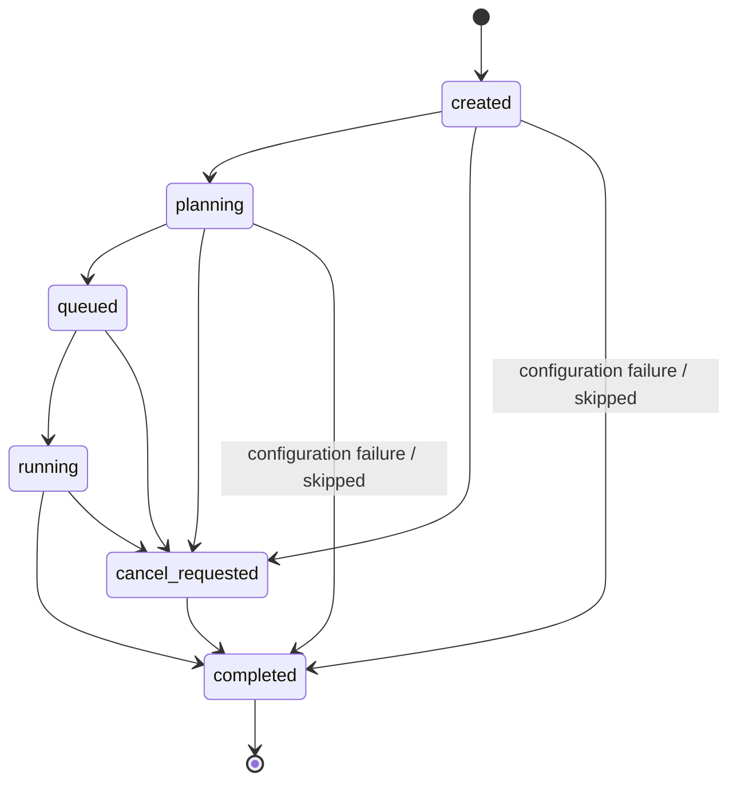
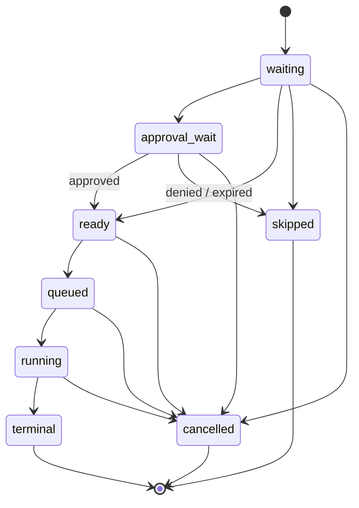
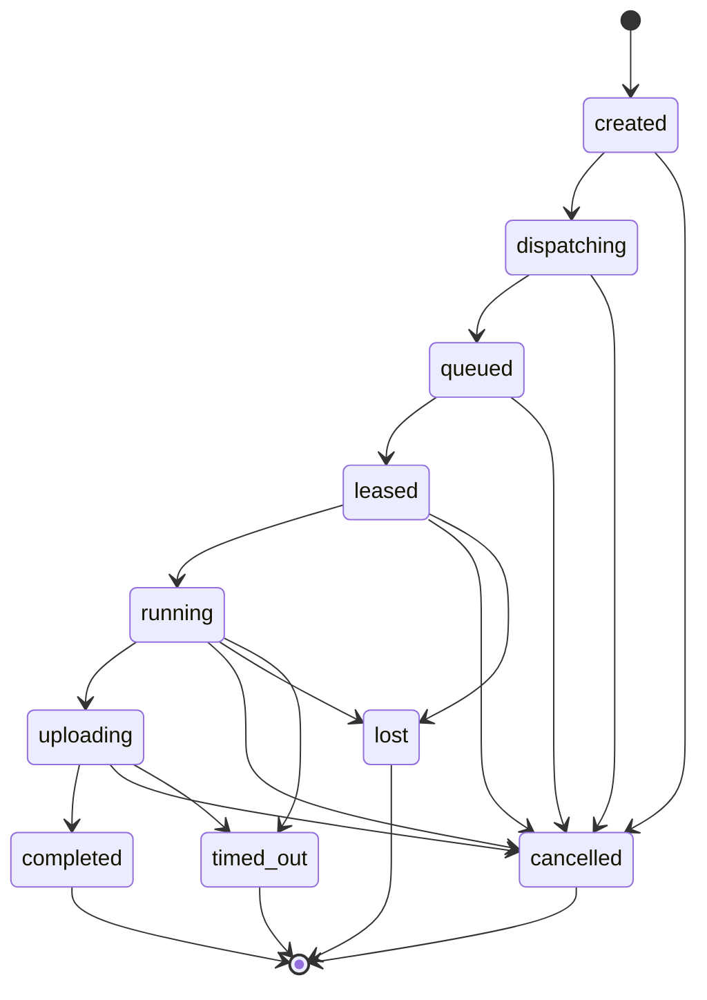
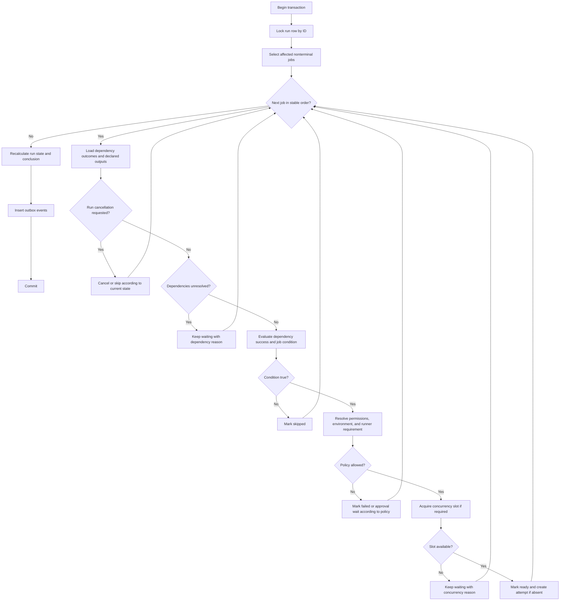

# Control plane and scheduler

## Outcome

Provide one durable authority for workflow runs, expanded jobs, attempts, dependencies,
concurrency, approvals, retries, cancellation, and runner leases. The scheduler must recover from
duplicate messages and service crashes without losing accepted work or accepting stale results.

## Service decomposition

Begin with separately testable modules that may deploy in fewer processes during the vertical
slice:

- domain command handler;
- scheduler evaluator;
- matrix expander;
- policy and authorization evaluator;
- concurrency manager;
- attempt/lease manager;
- transactional outbox publisher;
- queue dispatcher;
- timeout/reconciliation worker;
- public API facade.

Module boundaries and database ownership matter before deployment count does.

## Database model

### Workflow runs

```text
runs
  id uuid primary key
  account_id uuid not null
  repository_id uuid not null
  workflow_plan_id uuid not null
  workflow_id text not null
  source_sha text not null
  source_ref text not null
  event_id uuid not null
  trigger_kind text not null
  state text not null
  outcome text null
  conclusion text null
  requested_by_kind text not null
  requested_by_id text not null
  rerun_of_run_id uuid null
  concurrency_key text null
  cancel_in_progress boolean not null
  policy_snapshot_id uuid not null
  plan_hash text not null
  created_at timestamptz not null
  started_at timestamptz null
  completed_at timestamptz null
  cancel_requested_at timestamptz null
  version bigint not null
```

Indexes:

- repository and creation time;
- source SHA and workflow ID;
- nonterminal state and creation time;
- concurrency key for nonterminal runs;
- event ID;
- rerun relationship.

### Logical jobs

```text
jobs
  id uuid primary key
  run_id uuid not null
  definition_id text not null
  expanded_id text not null
  display_name text not null
  matrix_values jsonb not null
  state text not null
  outcome text null
  conclusion text null
  continue_on_error boolean not null
  effective_runner_requirement jsonb not null
  effective_permissions jsonb not null
  environment_id uuid null
  concurrency_key text null
  queue_timeout_ms bigint not null
  execution_timeout_ms bigint not null
  max_attempts integer not null
  next_attempt_number integer not null
  condition_ast jsonb null
  condition_explanation jsonb null
  created_at/ready_at/started_at/completed_at timestamptz
  version bigint not null
  unique(run_id, expanded_id)
```

### Dependencies

```text
job_dependencies
  run_id uuid not null
  job_id uuid not null
  dependency_job_id uuid not null
  required_result_policy jsonb not null
  primary key(job_id, dependency_job_id)
```

Dependency rows refer to expanded jobs after matrix mapping. Initial v1 behavior makes a
non-matrix downstream job depend on every expansion of an upstream matrix job.

### Attempts

```text
job_attempts
  id uuid primary key
  account_id uuid not null
  job_id uuid not null
  attempt_number integer not null
  state text not null
  failure_class text null
  outcome text null
  conclusion text null
  runner_pool_id uuid null
  runner_session_id uuid null
  lease_id uuid null
  fence bigint not null
  dispatch_key text not null unique
  queued_at/leased_at/started_at/completed_at timestamptz
  heartbeat_at timestamptz null
  lease_expires_at timestamptz null
  cancel_requested_at timestamptz null
  exit_code integer null
  error_code text null
  error_summary text null
  cleanup_status text null
  version bigint not null
  unique(job_id, attempt_number)
```

### Outputs and decisions

```text
job_outputs
  job_id uuid
  name text
  value_object_key text
  value_sha256 bytea
  size_bytes bigint
  classification text
  created_at timestamptz
  primary key(job_id, name)

scheduling_decisions
  id uuid primary key
  run_id uuid
  job_id uuid null
  decision_type text
  source_path text
  inputs_redacted jsonb
  result jsonb
  explanation jsonb
  created_at timestamptz
```

Outputs become visible atomically with a successful terminal attempt and schema validation.

### Commands and outbox

```text
commands
  id uuid primary key
  idempotency_key text
  account_id uuid
  command_type text
  target_type text
  target_id uuid
  requested_by jsonb
  request_digest text
  state text
  response jsonb null
  created_at/completed_at
  unique(account_id, idempotency_key)

outbox_events
  id uuid primary key
  topic text
  partition_key text
  payload jsonb
  available_at timestamptz
  published_at timestamptz null
  publish_attempts integer
  last_error text null
```

## State machines

### Run state



Planning may precede run creation in the initial architecture. If so, `planning` is represented by
a separate planning request and a run begins at `created`. Pick one model in the state-machine ADR
and expose one consistent public lifecycle.

### Job state



Terminal outcomes:

- success;
- failure;
- cancelled;
- timed out;
- skipped;
- neutral where an explicitly supported policy requires it.

Conclusion may differ from outcome only through documented continue-on-error semantics.

### Attempt state



A database transition function validates expected current state, entity version, and active fence.
Invalid transitions return a stable conflict code and record safe diagnostics.

## Run creation transaction

1. Lock or insert logical run key.
2. Load validated plan and immutable policy snapshot.
3. Evaluate event trigger and workflow-level concurrency key.
4. Expand all static matrices within configured limit.
5. Insert run, jobs, and dependency edges.
6. Record initial condition and policy decisions.
7. Transition dependency-free eligible jobs to approval wait or ready.
8. Insert outbox events for Checks and ready attempts.
9. Commit once.

If another worker created the logical run, return its ID. Do not create and later merge duplicates.

## Scheduler evaluation loop

The scheduler is event driven with a periodic repair scan.

Inputs that can make progress possible:

- run created;
- dependency job terminal;
- approval granted/denied/expired;
- concurrency owner released;
- retry delay elapsed;
- runner/policy configuration changed;
- cancellation requested.

Pseudo-algorithm for one run:



Use `FOR UPDATE SKIP LOCKED` or an equivalent bounded claim query for repair workers, never a
global scheduler lock.

## Dependency and condition semantics

- Default condition is success of all declared dependencies.
- `always()` runs after dependencies reach any terminal state, not while unresolved.
- `failure(job)` checks original outcome, not continue-on-error conclusion.
- `cancelled(job)` checks terminal cancellation.
- Missing output is null with explicit diagnostics when accessed contrary to schema.
- A skipped dependency is not success unless the condition explicitly permits it.
- Job condition evaluation occurs once dependency inputs are stable and is recorded.
- Runtime policy reauthorization may still deny a previously planned job at lease time.

## Concurrency

### Scope

Concurrency keys may scope to:

- account;
- repository;
- workflow;
- environment;
- custom declared group within an allowed namespace.

Normalized key includes scope identifiers to prevent cross-tenant collisions.

### Acquisition

```text
concurrency_slots
  scope_type/scope_id/key
  owner_type/owner_id
  acquired_at
  heartbeat_or_progress_at
  primary key(scope_type, scope_id, key)
```

Acquire with one conditional insert. Release in the same transaction that makes the owner
terminal. Repair stale slots by checking authoritative owner state.

### Cancel in progress

When a new run requests cancellation of the current owner:

1. Insert new run waiting for slot.
2. Set old run's durable cancellation request.
3. Dispatch cancellation to its active attempts.
4. Release slot only when old owner reaches the defined safe terminal point.
5. Promote newest eligible waiter according to documented ordering.

Do not let multiple queued runs repeatedly cancel each other without an account policy and audit.

## Environment approvals

```text
environment_approval_requests
  id, account_id, repository_id, environment_id, job_id
  requested_at, expires_at, state
  policy_snapshot_id

environment_approvals
  request_id, decision, actor_id, reason, decided_at
  approved_source_sha, approved_plan_hash
```

Rules:

- Approval binds to exact source SHA, plan hash, environment, and job.
- Workflow source changes invalidate approval where policy requires it.
- Approvers cannot approve their own run when separation-of-duty policy forbids it.
- Secrets resolve only after valid approval and active attempt lease.
- Expiration is explicit and scheduler-visible.

## Retry policy

Retry definition includes:

- maximum attempts;
- retryable failure classes;
- exponential/fixed delay and maximum delay;
- optional jitter calculated deterministically from attempt ID;
- retry on runner loss, provisioning failure, task exit, timeout, or infrastructure failure;
- fail-fast interaction.

Default:

- retry runner/provisioning infrastructure failure once;
- do not retry task failure automatically;
- never retry a job after cancellation;
- manual rerun always creates an auditable command and new attempt/run as selected.

The agent reports evidence; the server assigns trusted failure class. A repository cannot label a
task failure as infrastructure failure to obtain unlimited retries.

## Cancellation and timeout

### Cancellation phases

1. Accept idempotent cancel command.
2. Mark run/job/attempt desired cancellation state.
3. Prevent new attempts.
4. Deliver cancel on next heartbeat/stream or provider termination API.
5. Agent sends process termination progress and cleanup result.
6. After grace deadline, provider forcibly terminates sandbox.
7. Lease controller finalizes if agent cannot.

### Timeouts

Track separately:

- planning;
- queue wait;
- provider provisioning;
- checkout/bootstrap;
- task execution;
- artifact/log finalization;
- cancellation grace;
- total run duration.

Timeout workers query indexed deadlines. A queue message is an optimization, not the only trigger.

## Queue dispatch and leases

### Capability partitioning

Use a bounded set of queue partitions such as account/pool/OS/architecture/size class. Avoid a
queue for every arbitrary capability combination.

The attempt payload contains only identity and matching summary. The agent retrieves authoritative
job specification after claim.

### Dispatch

1. Ready attempt inserts `attempt.ready` outbox row.
2. Publisher sends message with `dispatch_key` and attempt ID.
3. Publisher records provider message ID and timestamp.
4. Duplicate sends are safe.
5. Agent/controller requests claim.
6. Lease transaction verifies state, pool permission, capability, and quota.

### Lease

Lease contains:

- random lease ID;
- monotonically increasing fence per attempt;
- runner session ID;
- issue and expiry timestamps;
- heartbeat interval and grace;
- scoped attempt token identifier.

Every mutable attempt endpoint checks the current lease ID and fence in PostgreSQL.

## Fairness, quotas, and backpressure

Initial controls:

- maximum active runs per account/repository;
- maximum expanded jobs per run;
- maximum queued and running jobs;
- runner pool concurrency;
- resource class and region quotas;
- planner concurrency;
- log/artifact/cache byte rates;
- API rate limits;
- monthly budget state.

Scheduling fairness:

- fair-share between accounts at shared managed pools;
- FIFO within priority and capability class, with aging;
- separate service/system priority that cannot starve customer work;
- no user-defined arbitrary priority until abuse controls exist.

When capacity is exhausted, retain a durable waiting reason and estimated position where reliable.
Never spin/requeue at high rate.

## Public API outline

```text
GET    /v1/repositories/{repo}/workflows
GET    /v1/repositories/{repo}/runs
POST   /v1/repositories/{repo}/workflows/{workflow}/dispatch
GET    /v1/runs/{run}
POST   /v1/runs/{run}/cancel
POST   /v1/runs/{run}/rerun
GET    /v1/runs/{run}/jobs
GET    /v1/jobs/{job}
POST   /v1/jobs/{job}/rerun
POST   /v1/jobs/{job}/approve
POST   /v1/jobs/{job}/deny
GET    /v1/jobs/{job}/attempts
GET    /v1/attempts/{attempt}/events
GET    /v1/runs/{run}/stream
```

Mutation requirements:

- bearer identity with account/repository authorization;
- `Idempotency-Key`;
- request digest conflict detection;
- command resource returned for long-running mutations;
- audit actor and reason where appropriate.

## Recovery and reconciliation

Periodic queries detect:

- ready attempt without outbox/queue publication;
- queued attempt past dispatch SLA;
- expired lease;
- terminal attempt with nonterminal job;
- terminal jobs with nonterminal run;
- concurrency slot whose owner is terminal;
- cancellation request without active delivery;
- timeout deadline passed;
- outbox item unpublished beyond SLA.

Repair calls the same idempotent domain commands as normal processing. It does not patch rows with
ad hoc SQL.

## Scaling plan

### Initial targets

- 100 concurrently running jobs;
- 10,000 jobs/day;
- 1,000 expanded jobs/run hard platform limit, lower default;
- scheduler decision p95 below two seconds excluding provisioning;
- no account can consume more than configured fair share.

### Scale-out

- partition repair scans by account/repository hash;
- keep transactions scoped to one run or attempt;
- avoid querying JSON fields on hot paths; materialize indexed matching attributes;
- archive terminal event/log metadata away from hot indexes under retention policy;
- use read replicas only for stale-tolerant UI reads, never scheduling decisions;
- load test ten times expected beta volume before raising quotas.

## Implementation work packages

### CTRL-01: migrations and domain repositories

- Core tables, constraints, indexes, timestamps, and versions.
- Migration/rollback and generated schema documentation.

### CTRL-02: state transition library

- Pure legal transitions and conclusions.
- Database optimistic/pessimistic locking adapter.
- Stable conflict/error codes.

### CTRL-03: run creation and matrix expansion

- Logical dedupe.
- policy snapshot.
- jobs/dependencies.
- initial readiness.

### CTRL-04: scheduler evaluator

- dependency conditions.
- outputs.
- approvals.
- concurrency.
- terminal run calculation.

### CTRL-05: attempts, retries, cancellation, and timeout

- attempt creation.
- failure classification.
- deadline workers.
- retry delay.
- cancel state.

### CTRL-06: outbox and capability dispatcher

- publisher claims and retry.
- queue partitioning.
- DLQ inspection and replay.

### CTRL-07: runner sessions and leases

- registration integration.
- claim transaction.
- heartbeat.
- expiry and fencing.

### CTRL-08: API and authorization

- Read resources.
- idempotent commands.
- pagination and stream cursors.
- audit.

### CTRL-09: reconciler

- Invariant scans.
- idempotent repair commands.
- operator visibility and alerting.

## Test plan

### State-model tests

Generate valid/invalid transition sequences and compare pure model with PostgreSQL implementation.

### Transaction race tests

- duplicate run creation;
- two scheduler workers;
- two agents claim one attempt;
- cancel races with lease/start/complete;
- timeout races with completion;
- retry races with late old result;
- concurrency acquisition/release races;
- approval races with cancellation or new commit.

### Queue tests

- duplicate, delayed, missing, and reordered messages;
- visibility timeout and redelivery;
- poison payload to DLQ;
- dispatcher crash before/after send and before/after marking published.

### Failure-injection tests

Kill service after every durable transition, fail PostgreSQL commit, throttle queue, expire lease,
and restart all schedulers. Assert bounded recovery and one authoritative state.

### Load tests

- wide matrix;
- deep DAG;
- many small repositories;
- one noisy account;
- mass cancellation after force push;
- GitHub outage creating projection backlog.

## Exit criteria

- State machines, schema, and event contracts are versioned and reviewed.
- Duplicate run/event/queue/claim paths are safe by database constraint and fencing.
- Scheduler and local simulator pass identical semantic conformance fixtures.
- Cancellation, timeout, retry, approval, and concurrency races pass repeatedly.
- Reconciler repairs every intentionally injected partial failure.
- Load targets meet latency and fairness objectives with observed headroom.
- Operators can explain why every nonterminal job is waiting.
