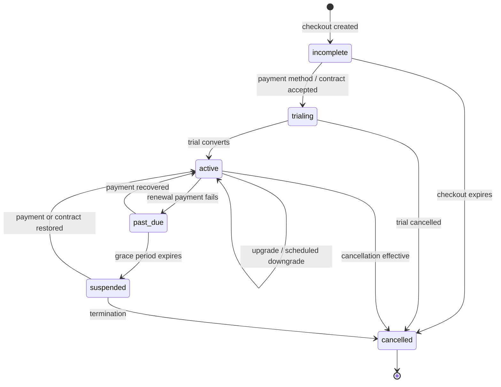

# Product, API, UI, and billing

Status: implementation plan

Owners: product, API, web, developer experience, finance systems

Depends on: [planner](05-github-app-and-planner.md), [scheduler](06-control-plane-and-scheduler.md), [data plane](09-logs-artifacts-and-cache.md)

## Outcome

Turn the CI engine into an operable product. A developer can install the GitHub App, validate a workflow locally, run it, understand every scheduling and execution decision, inspect output, approve protected work, and diagnose failure without guessing. Organization owners can govern access, runners, usage, and spend.

The same product surface includes the complete managed-service subscription lifecycle: plan
selection, trial, checkout, effective entitlements, plan changes, cancellation, payment recovery,
usage, invoices, and enterprise contract overrides.

## Primary personas

| Persona | Core need |
| --- | --- |
| Workflow author | write and test typed CI logic locally |
| Contributor | see whether a commit passed and why it failed |
| Maintainer | approve, rerun, cancel, and diagnose repository automation |
| Platform engineer | govern runners, environments, policies, and reusable workflow libraries |
| Security engineer | audit identities, secrets, permissions, and privileged execution |
| Billing owner | understand and control usage and cost |
| Support operator | diagnose service faults without unrestricted customer-data access |

## Product journeys

### Onboarding

1. User signs in through GitHub.
2. User creates or selects a bz organization.
3. User installs the GitHub App for selected repositories.
4. bz verifies webhook, installation permissions, default branch, and repository accessibility.
5. UI detects bz workflow files and runs a safe validation/plan preview.
6. If none exist, UI offers a minimal template or GitHub Actions migration report.
7. User chooses bridge mode, BYOC runner, or managed runner where available.
8. A test event produces a check run and links to the first bz run.

Success means first green run is possible without manually copying permanent tokens.

### Workflow change

1. Author runs `bz ci check` and scenario tests locally.
2. Pull request receives a plan preview: jobs added/removed, runner/permission changes, and protected-environment impact.
3. GitHub check links to structured diagnostics for invalid plans.
4. Reviewers can see the exact source SHA and workflow digest used.
5. Merge/push triggers the immutable reviewed definition.

### Failure diagnosis

1. Run graph highlights the failed/cancelled/blocked job.
2. Job page opens at the failing step and relevant annotation.
3. Explanation panel separates user exit failure, policy denial, runner infrastructure failure, platform incident, and cancellation.
4. User sees inputs, dependencies, matrix entry, runner image, cache results, retries, and redacted command context.
5. UI offers only valid recovery actions: rerun failed job, rerun downstream graph, rerun all, cancel, or contact an administrator.

### Protected deployment

1. Plan declares an environment and OIDC permission.
2. Scheduler pauses before credential-bearing work.
3. Authorized reviewer sees source SHA, workflow digest, requesting actor, diff summary link, permissions, and destination.
4. Approval is single-use and bound to the job generation.
5. Job exchanges bz OIDC for cloud credentials and audit records link approval to issuance.

## Public API

### Conventions

- base path `/v1` and JSON over HTTPS;
- opaque string IDs with resource prefixes;
- RFC 3339 UTC timestamps;
- cursor pagination with stable ordering;
- idempotency keys for creation and action endpoints;
- `ETag`/version preconditions for policy mutations;
- stable machine error code, human message, field path, and request ID;
- explicit expansion parameters rather than unbounded nested payloads;
- rate-limit headers and retry guidance;
- OpenAPI generated from or checked against server route contracts.

Error envelope:

```json
{
  "error": {
    "code": "environment_approval_required",
    "message": "Production approval is required before this job can run.",
    "requestId": "req_...",
    "details": { "environmentId": "env_..." }
  }
}
```

### Resource endpoints

Organizations and repositories:

- `GET/POST /v1/organizations`
- `GET/PATCH /v1/organizations/{id}`
- `GET /v1/organizations/{id}/members`
- `GET /v1/organizations/{id}/repositories`
- `GET/PATCH /v1/repositories/{id}`
- `POST /v1/repositories/{id}/sync`

Workflows and plans:

- `GET /v1/repositories/{id}/workflows`
- `GET /v1/workflows/{id}`
- `POST /v1/workflows/validate`
- `POST /v1/workflows/simulate`
- `GET /v1/plans/{id}`
- `GET /v1/plans/{id}/explanation`

Runs:

- `GET /v1/repositories/{id}/runs`
- `GET /v1/runs/{id}`
- `GET /v1/runs/{id}/jobs`
- `POST /v1/runs/{id}/cancel`
- `POST /v1/runs/{id}/rerun`
- `POST /v1/jobs/{id}/rerun`
- `GET /v1/runs/{id}/events`

Governance:

- `GET/POST/PATCH /v1/.../environments`
- `GET/POST/PATCH/DELETE /v1/.../secrets`
- `GET/POST/PATCH /v1/.../runner-pools`
- `GET /v1/.../audit-events`
- `GET/PATCH /v1/.../policies`

Usage and billing:

- `GET /v1/product-plans`
- `GET /v1/organizations/{id}/subscription`
- `POST /v1/organizations/{id}/subscription/checkout-session`
- `PATCH /v1/organizations/{id}/subscription`
- `POST /v1/organizations/{id}/subscription/cancel`
- `POST /v1/organizations/{id}/billing-portal-session`
- `GET /v1/organizations/{id}/entitlements`
- `GET /v1/organizations/{id}/usage`
- `GET/PATCH /v1/organizations/{id}/budgets`
- `GET /v1/organizations/{id}/invoices`
- `GET /v1/organizations/{id}/usage/export`

Bulk bytes use the signed-grant data-plane endpoints described elsewhere.

### Streaming

Use Server-Sent Events first for run state and logs because clients primarily receive ordered server updates. Every event has ID, type, resource version, and timestamp. Clients reconnect with `Last-Event-ID`; durable REST state repairs gaps. WebSockets are introduced only if bidirectional semantics justify them.

### API lifecycle

- publish a compatibility policy before beta;
- changes are additive within `/v1` except security fixes;
- deprecations include response headers, documentation, telemetry, and a published removal window;
- beta fields are namespaced or explicitly labeled;
- generate client fixtures and contract tests from real API examples;
- sanitize examples so recorded fixtures contain no customer secrets.

## CLI

### Command groups

```text
bz auth login|status|logout
bz ci check [workflow]
bz ci test [workflow] [--scenario ...]
bz ci simulate [workflow] [--event fixture.json]
bz ci explain [workflow|run|job]
bz ci bridge generate
bz ci migrate github-actions
bz run list|view|watch|cancel|rerun
bz logs [run|job] [--follow]
bz artifacts list|download
bz runners list|doctor|enroll
bz secrets set|list|delete
bz oidc policy generate|verify
bz admin doctor
```

### CLI requirements

- human-readable output by default and stable `--json` output for automation;
- actionable exit codes for validation, test failure, authentication, policy, infrastructure, and service errors;
- no browser requirement after a supported device/login flow has completed;
- config precedence documented and inspectable with `bz config explain`;
- redact tokens and secrets from errors and debug bundles;
- `--trace` records request IDs and timings but no credential bodies;
- shell completions and signed release binaries for supported platforms.

Local commands must not require network unless resolving declared remote dependencies or comparing server policy; they clearly label such access.

## Web application

### Information architecture

- organization selector and health/usage overview;
- repository overview;
- workflow catalog and definition versions;
- run list and run detail graph;
- job/attempt detail with logs;
- artifacts and cache insights;
- environments and approvals;
- secrets and OIDC federation;
- runner pools and capacity;
- members, roles, GitHub installation, policies, audit, usage, subscription, and billing;
- incident/service status links.

### Live run experience

In bz terminology, GitHub “actions” become workflow jobs and task steps. The web application is a
first-class live execution surface, not only a configuration console.

For a running workflow it shows:

- the expanded job DAG with waiting, approval, queued, provisioning, running, uploading, cleanup,
  retrying, and terminal states updating live;
- start time, elapsed time, queue time, runner pool/image, matrix values, attempt number, and
  current step for every job;
- streaming stdout, stderr, system messages, annotations, and step summaries with reconnect by
  durable log sequence;
- dependency, condition, policy, concurrency, quota, and runner-capability explanations;
- artifacts and outputs as they become finalized, without exposing partial uploads;
- approval/deny actions for authorized reviewers;
- cancel run, cancel eligible job, rerun failed, rerun with dependencies, and rerun all controls;
- GitHub commit, pull request, check, source SHA, plan digest, and workflow-definition links;
- a degraded-state banner when GitHub projection or live fanout is delayed while internal
  execution continues.

REST remains the durable source of truth; SSE supplies updates. Reloading or switching devices
reconstructs the same state without relying on an in-memory browser session.

### Run graph

The graph is a projection of the immutable plan plus current states. It supports:

- clear terminal/nonterminal color and text labels;
- matrix grouping and expansion;
- dependency edges and skipped-condition reasons;
- critical path and waiting reason;
- attempts/retries without pretending they are separate jobs;
- accessibility through an equivalent list/table and keyboard navigation;
- copyable stable URLs for a run, job, attempt, step, and log sequence.

### Explanation UI

Every waiting, skipped, denied, retried, or cancelled state shows a structured reason generated by the engine:

- evaluated expression with redacted operands;
- unmet dependency and its terminal result;
- missing runner capabilities or quota;
- concurrency holder;
- required environment approval;
- retry classification and next eligible time;
- cancellation actor/source;
- policy rule and administrator action where appropriate.

The UI renders reason codes; it does not reconstruct semantics from logs.

### Log viewer

- streams and resumes by sequence;
- virtualizes large logs;
- groups/folds by step while preserving ordering;
- searches loaded or server-indexed content;
- links annotations to repository file/line at the exact SHA;
- shows truncation and missing-sequence states visibly;
- permits raw verified download subject to authorization;
- never injects ANSI/control sequences into the DOM unsafely.

### Administration and support

Organization admins can inspect policy evaluation, GitHub sync state, runner health, queue reason, usage, and audit history. Support access requires a ticket/reason, customer or dual approval based on severity, time limit, and complete audit. Impersonation is avoided; diagnostic views identify their source and permissions.

## Notifications and integrations

Initial notifications:

- GitHub check/status and annotations;
- email for approval, budget threshold, installation failure, and security events;
- generic signed webhooks for run/job terminal events.

Later: Slack/Teams and incident-management integrations. Notification delivery is asynchronous, retryable, deduplicated by `(event_id, destination, template_version)`, and never controls run correctness.

## Usage and billing

### Service subscriptions and entitlements

The SaaS requires an explicit subscription service in addition to usage metering. Payment-provider
state is an integration input; bz's durable subscription and entitlement snapshot is the
authorization source used by the scheduler.

Initial commercial model:

| Plan | Intended customer | Runner access | Commercial shape |
| --- | --- | --- | --- |
| Free/developer | evaluation and small projects | bridge plus limited BYOC/control-plane use | fixed included allowance |
| Team | private repositories and managed Linux | managed usage plus included allowance | base subscription plus usage |
| Enterprise | larger organizations and compliance needs | BYOC and managed pools | contract, commits, or invoiced usage |

Exact names, limits, prices, and whether a free plan ships are product decisions. The system models
them through a versioned catalog rather than hard-coded conditionals.

Subscription lifecycle:



Required behavior:

- hosted checkout and billing portal keep payment-card data out of bz services;
- subscriptions belong to a billing account linked one-to-one with an organization initially;
- a versioned product catalog defines base price, included usage, overage meters, retention,
  concurrency, managed runner sizes, BYOC limits, support level, and feature entitlements;
- trials have explicit start/end, plan, included allowance, and conversion rules;
- upgrades can take effect immediately with provider-calculated proration;
- downgrades and cancellations default to period end and warn about incompatible current usage;
- provider webhook deliveries are signature-verified, durably stored, deduplicated, ordered per
  subscription where possible, and reconciled by periodic provider reads;
- `past_due` enters a documented grace period with owner notifications and retry status;
- suspension stops new chargeable jobs but does not delete repositories, logs, artifacts, audit,
  or billing history;
- protected/deployment jobs receive an explicit organization policy for suspension behavior rather
  than being terminated unexpectedly;
- resumption recalculates entitlements before new work is admitted;
- enterprise manual contracts use the same entitlement model with an audited administrative source;
- taxes, invoice identity, currency, refunds, credits, and provider customer mapping are modeled
  without putting fiscal logic in the scheduler.

Core records:

```text
product_plans(plan_id, version, currency, billing_interval, active_from, retired_at)
product_prices(price_id, plan_id, meter, unit_amount, included_quantity, effective_from)
billing_accounts(account_id, organization_id, provider, provider_customer_id, invoice_profile)
subscriptions(subscription_id, account_id, plan_version, status, period_start, period_end,
  trial_end, cancel_at, provider_subscription_id, version)
subscription_items(subscription_id, price_id, quantity)
entitlement_snapshots(account_id, subscription_version, key, value, effective_at, expires_at)
billing_provider_events(provider, external_event_id, payload_digest, state, received_at, processed_at)
```

The API service evaluates management permissions and displays provider state. The scheduler reads a
local, versioned entitlement snapshot and records its version on admission decisions; it never
calls the payment provider in the scheduling transaction. Missing or stale entitlement data fails
according to a documented grace policy and emits a visible explanation.

### Immutable usage ledger

Producers emit versioned usage events through transactional outboxes:

```ts
type UsageEventV1 = {
  eventId: string;
  tenantId: string;
  repositoryId?: string;
  runId?: string;
  jobId?: string;
  attemptId?: string;
  meter: "managed_compute_ms" | "storage_byte_hours" | "egress_bytes";
  dimensions: {
    runnerSize?: string;
    architecture?: string;
    region?: string;
    storageClass?: string;
  };
  quantity: number;
  intervalStart: string;
  intervalEnd: string;
  correctionOf?: string;
  observedAt: string;
};
```

Events are immutable and deduplicated by event ID. Corrections append inverse/replacement entries instead of editing history.

### Compute metering

Define charge boundaries before beta:

- managed compute begins when an assigned runner is ready to start the job, not while the job waits in queue;
- it ends at terminal job cleanup boundary with documented rounding;
- platform-caused failed attempts are classified and credited automatically;
- BYOC control-plane pricing uses a separate run/concurrency model if charged;
- per-size/architecture multiplier comes from a versioned price catalog;
- retry attempts remain separately visible.

Pricing policy is a product decision, but instrumentation and replay must make alternative models possible without losing raw truth.

### Storage metering

Artifact/cache finalized bytes create byte-hour intervals; deletion/expiry closes them. Logs may be included in compute tiers or separately metered, but raw bytes and retention remain measurable. Abandoned uploads and replicas do not become customer billable usage.

### Rating and invoices

1. Usage ledger validates and aggregates raw events.
2. Rating applies the price catalog effective at event time.
3. Credits/discounts are separate ledger entries.
4. Daily customer usage projections remain labeled provisional.
5. Period close reconciles control-plane usage, object storage, cloud compute, and payment-provider items.
6. Invoice line items link to exportable usage dimensions without revealing protected repository data.

External payment provider integration is isolated behind a billing adapter. Payment webhooks are verified, idempotent, and reconciled.

### Budgets and limits

- threshold alerts at configurable percentages;
- repository and organization soft limits;
- optional hard stop applies only to new nonprotected jobs and has explicit safety rules;
- protected/deployment behavior is configured rather than surprisingly killed;
- budget evaluation is based on projected rated usage with visible delay;
- owners can see which workflows/runner sizes drive cost.

### Reconciliation

Daily jobs compare:

- scheduler attempt intervals versus compute usage events;
- finalized/deleted storage resources versus byte-hour ledger;
- rated totals versus invoice provider;
- fleet cloud cost versus capacity and billed minutes;
- credits for platform incidents versus affected attempts.

Any discrepancy above tolerance freezes period close and creates an auditable billing incident.

## Accessibility, privacy, and localization

- target WCAG 2.2 AA for core journeys;
- keyboard and screen-reader alternatives for graphs and live logs;
- do not use color as the sole status signal;
- honor reduced motion;
- define personal data and retention for identities, IP classifications, logs, and audit;
- expose organization data export/deletion process;
- begin with localization-ready message IDs, dates, durations, and numbers even if launch language is English.

## Work packages

### PROD-01: API foundation

- conventions, auth middleware, authorization hooks, errors, pagination, idempotency, versioning, OpenAPI, and SDK generation;
- contract and negative authorization tests.

Done when core organization/repository/run APIs meet one compatibility contract.

### PROD-02: CLI foundation and local CI commands

- auth/config/output/diagnostics;
- check, test, simulate, explain, run view/watch, and logs;
- signed cross-platform release pipeline.

Done when a new workflow can be developed and diagnosed locally without the web UI.

### PROD-03: onboarding and repository UI

- sign-in, organization creation, GitHub install/sync, repository health, starter/migration flow;
- analytics for each onboarding drop-off without collecting workflow source.

Done when the beta onboarding success target is met in usability tests.

### PROD-04: run, job, and log experience

- run list, graph/table, attempts, streaming logs, annotations, artifacts, explanations, and actions;
- accessibility and large-run performance tests.

Done when seeded failures can be correctly diagnosed by target users.

### PROD-05: environments, secrets, OIDC, and runners administration

- policy-aware settings, approval inbox, secret metadata, OIDC recipe generator, pool health/capacity;
- require recent authentication for sensitive mutations.

Done when maintainers complete protected deployment and BYOC setup journeys.

### PROD-06: audit and support console

- customer audit search/export;
- just-in-time diagnostic access and tenant-safe support views;
- incident correlation by request/event/run IDs.

Done when support scenarios are resolved without database access or impersonation.

### BILL-01: usage event and ledger

- define meters/boundaries, outbox ingestion, idempotency, corrections, aggregates, and exports;
- replay historical raw events through new rating versions.

Done when failure injection cannot double charge or lose usage.

### BILL-02: rating, budgets, and provider integration

- price catalog, credits, provisional usage, budgets/alerts, invoice adapter, and period reconciliation;
- implement incident credits and close controls.

Done when shadow invoices reconcile within accepted tolerance for two periods.

### BILL-03: subscription and entitlement lifecycle

- implement product/price catalog, billing accounts, trials, checkout, upgrades, scheduled
  downgrades, cancellation, dunning, suspension, resumption, and enterprise overrides;
- ingest and reconcile signed provider webhooks idempotently;
- materialize versioned entitlements and enforce them locally in API, scheduler, retention, and
  runner-capacity decisions;
- build organization subscription/usage/invoice UI and owner notifications;
- test proration, late/out-of-order events, grace periods, provider outage, and restoration.

Done when every plan transition produces deterministic entitlements, usage admission behavior, an
auditable customer-visible state, and a reconciled provider record.

## Product validation

- usability tests for onboarding, failed-run diagnosis, approval, OIDC setup, and runner troubleshooting;
- API contract tests across current and prior supported clients;
- accessibility automated scans plus manual keyboard/screen-reader review;
- 10,000-job run graph and 1 GB log viewer performance tests;
- authorization tests for every UI/API action and cross-tenant URL;
- billing replay, duplicate, correction, late-event, rounding, and period-close tests;
- subscription checkout, trial, upgrade, downgrade, cancellation, payment failure, suspension,
  resumption, provider outage, and webhook reordering tests;
- chaos tests where notification, analytics, payment provider, and live fanout are unavailable;
- privacy review for telemetry, support access, exports, and retention.

## Exit criteria

- A user can go from GitHub installation to first run without a permanent copied token.
- Workflow changes can be checked, tested, simulated, and explained locally.
- Every non-success state has a structured reason and a valid next action.
- Core API and CLI contracts are versioned and tested for compatibility.
- Administrative and support actions are least-privileged and audited.
- Organizations can subscribe, trial, change plan, cancel, recover payment, and inspect effective
  entitlements without scheduler dependence on the payment provider.
- Usage is immutable, replayable, correctable, and reconciled before billing.
- Core experiences meet accessibility and large-run/log performance targets.
