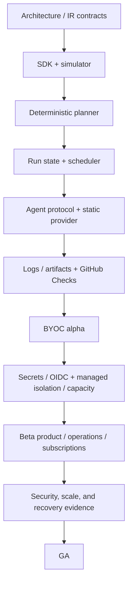

# Delivery program

Status: implementation plan

Owners: engineering leadership and all workstream leads

Depends on: [all detailed plans](README.md)

## Outcome

Deliver a complete CI product through evidence-based increments, beginning with bz's differentiator—local deterministic testability—and ending with a secure, supported managed service. Each milestone produces something usable and has a stop/go gate; calendar dates do not override correctness or security evidence.

## Planning assumptions

- Core team: five to seven experienced engineers plus fractional product/design, security, and SRE support.
- Initial production platform: GitHub, Linux x86-64, one AWS region/multi-AZ, PostgreSQL/SQS/S3, ECS services.
- First runner paths: static local, BYOC Kubernetes, then managed disposable Linux.
- Public workflow authoring: TypeScript bz SDK compiled to a versioned declarative plan.
- GitHub Actions bridge remains available throughout migration.
- The beelzebub repository begins DF0 immediately and consumes every safe new slice before external
  rollout.
- Windows, macOS, GPU, multi-region active-active, broad Marketplace action compatibility, and enterprise SSO are post-GA unless a design partner changes priorities.
- Expected path with the stated team is roughly 12–18 months to a responsibly scoped GA; discovery results may change this.

## Workstreams

| Lane | Responsibility | Detailed plan |
| --- | --- | --- |
| Dogfood | real repository adoption, parity, promotion, and fallback | DF0–DF9 in this plan |
| Language | SDK, compiler, IR, expressions, diagnostics | [02](02-workflow-sdk-and-ir.md) |
| Testability | fixtures, simulator, conformance, explanations | [03](03-testing-and-simulation.md) |
| GitHub | bridge, App, webhooks, checks, planner | [04](04-github-bridge-and-migration.md), [05](05-github-app-and-planner.md) |
| Orchestration | run model, scheduler, leases, approvals | [06](06-control-plane-and-scheduler.md) |
| Execution | agent, protocol, providers, capacity, images | [07](07-runner-agent-and-protocol.md), [08](08-runner-infrastructure.md) |
| Data | logs, artifacts, cache | [09](09-logs-artifacts-and-cache.md) |
| Identity/security | authorization, secrets, OIDC, audit | [10](10-security-secrets-and-oidc.md) |
| Product | API, CLI, live execution UI, subscriptions, usage, billing | [11](11-product-api-ui-and-billing.md) |
| Operations | cloud foundation, delivery, SLO, DR | [12](12-platform-sre-and-disaster-recovery.md) |

A lane is an ownership model, not a permanent team silo. Cross-boundary contracts require reviewers from both sides.

## Critical path

Bridge-mode generation can ship alongside SDK/simulator. UI can start against fake/projected APIs once schemas stabilize. Cloud runner image/capacity work can begin once the agent handshake and job spec are versioned.

## Dogfood-first delivery lane

Dogfooding is a mandatory lane through every milestone, beginning with the first compilable workflow
slice. It does not wait for the complete bridge, control plane, UI, managed runners, or a milestone
release. Promotion happens one repository job at a time when that job's evidence passes.

The beelzebub repository is the first tenant and conformance repository. Design partners broaden
coverage later; they do not replace internal use.

### Dogfood progression

```mermaid
flowchart LR
  baseline[DF0 Baseline fixtures] --> local[DF1 Local plan + simulation]
  local --> bridgeShadow[DF2 One bridge job, non-required]
  bridgeShadow --> bridgeRequired[DF3 One bridge job, required]
  bridgeRequired --> bridgeFull[DF4 Generated bridge for non-release CI]
  bridgeFull --> plannerShadow[DF5 Native planner shadow]
  plannerShadow --> nativeShadow[DF6 Static runner, non-required]
  nativeShadow --> nativeRequired[DF7 One native job, required]
  nativeRequired --> nativeCI[DF8 Native non-release CI]
  nativeCI --> releaseAuthority[DF9 Native release authority]
```

| Stage | Earliest implementation point | Real beelzebub workload | Authority and fallback | Promotion evidence |
| --- | --- | --- | --- | --- |
| DF0 baseline | first M0 work | inventory current checks, scripts, events, permissions, secrets, outputs, artifacts, durations, and failure classes | current GitHub workflow remains authoritative | committed fixtures and a reviewed parity manifest |
| DF1 local | first minimal IR/compiler slice | model `format:check`, then lint/typecheck, with push, PR, fork, cancellation, and failure fixtures | no remote execution change | canonical plan is stable and seeded edge failures are caught locally |
| DF2 bridge shadow | minimal event/job IR plus thin emitter; do not wait for all M1 features | generate one no-secret `format:check` job under a distinct non-required Check | handwritten Check remains required | at least 20 correlated executions and no unexplained semantic difference |
| DF3 bridge authority | immediately after DF2 gate | make generated `format:check` required, then add lint/typecheck | prior workflow remains manually dispatchable and branch-protection rollback is rehearsed | at least 50 correlated executions over seven days, zero unexplained difference, and successful fallback drill |
| DF4 complete bridge | M2 grows feature by feature | migrate test, coverage, build, package validation, docs/site, and audit in risk order | GitHub Actions/Blacksmith/custom remains the scheduler; retain last-known-good workflow | every non-release job has parity evidence; original automatic scheduling is removed only job by job |
| DF5 planner shadow | first safe M3 planner | shadow-plan every beelzebub PR/push at its exact SHA without creating runs or Checks | generated bridge is authoritative | server plan digest/graph/permissions match local plan; planner failures are bounded and diagnosed |
| DF6 native shadow | first fenced scheduler/agent/log vertical slice | run format, then lint, on a trusted static runner with a distinct non-required bz Check and live UI | generated bridge stays required | at least 100 attempts over seven days with no duplicate effect, unexplained outcome, lost log, or cleanup residue |
| DF7 native authority | after DF6 and restore/rollback checks | make one low-risk bz Check required | bridge is manual emergency fallback; required-check restoration is documented and timed | fallback within 30 minutes, scheduler/agent restart tests pass, and user-visible failure reasons are correct |
| DF8 native non-release CI | M4–M5 capability gates | progressively move typecheck, unit, build, package, docs, cache, and artifact jobs | preserve bridge definitions and pins; protected publish/deploy stays on the established authority | beta SLO, security, cache/artifact, capacity, and restore evidence for each migrated risk tier |
| DF9 native release authority | M6 only | publish/deploy/release jobs with approvals, secrets, and OIDC | tested GitHub bridge fallback remains through early GA | 30-day SLO window plus outage, restore, key rotation, environment approval, and rollback drills |

The execution order follows risk, not duration:

1. deterministic, no-network, no-secret checks such as formatting;
2. lint and typecheck;
3. unit tests and coverage;
4. build and package validation;
5. documentation/site generation and other artifact-producing jobs;
6. dependency/network-sensitive audit or integration jobs;
7. credential-bearing publish, deploy, and release jobs last.

### Bootstrap and version rule

The repository must not require an unproven commit of bz to validate that same commit.

- The authoritative dogfood workflow consumes the last promoted bz SDK/CLI/bridge/agent version or
  an immutable artifact produced by the established bootstrap CI.
- Candidate code is built and tested by the established authority, then exercised in a distinct
  shadow Check before promotion.
- Generated workflow provenance records both the repository source SHA and the bz tool version.
- A promotion changes one explicit version pin or generated artifact and retains the prior pin for
  rollback.
- Database, plan, and protocol compatibility tests cover the promoted and immediately prior
  versions.
- A broken candidate can fail its own shadow lane without preventing a corrective PR from using the
  last promoted lane.

### Per-job promotion contract

A job advances one dogfood stage only when its promotion record contains:

- logical job ID, source/event set, plan digest, provider/runtime versions, and runner class;
- graph, permission, command, outcome, conclusion, output, annotation, summary, artifact, and cache
  comparison as applicable;
- classified differences with owner and expiry; “probably equivalent” is not a disposition;
- number and time span of correlated executions;
- observed platform failure, flake, queue, duration, and log-completeness results;
- secret/trust review for the job's current event types;
- branch-protection/check-name change and tested reversal procedure;
- named promotion approver and rollback owner.

Logs need not be byte-identical when timestamps or provider system messages differ. Semantic
command traces, user-visible outcome, declared outputs, artifacts, permissions, and security
decisions must agree.

### Continuous dogfood requirements

- Every CI-platform pull request runs local plan, simulation, conformance, and generated-file drift
  checks through the current authoritative workflow.
- Once a feature has a safe repository use case, the next increment must use it or record a dated,
  owned exception explaining the blocker.
- Dogfood failures are labeled separately as workflow/user, bridge, planner, scheduler, agent,
  runner/provider, data-plane, GitHub projection, or test-harness failures.
- Weekly review covers adoption by risk tier, parity differences, fallback readiness, time to
  diagnose, platform retry rate, and which handwritten CI remains.
- Release notes identify the first real repository job exercising every newly promoted contract.
- A milestone cannot pass if its promised dogfood stage is not active on the default branch.

### Fallback requirements

- Keep the last-known-good generated GitHub workflow and immutable tool pins available.
- Keep an original or generated fallback workflow manually dispatchable until DF9 has passed its
  early-GA retention period.
- Record exact required Check names and the branch-protection/API procedure to restore them.
- Test fallback before each authority promotion and at least monthly while native bz is required.
- Fallback never rewrites or deletes bz run history; it starts a separately attributable execution.
- Do not use the fallback to mask unexplained parity differences or exhausted reliability budgets.

## Milestone 0: contracts and risk retirement

Target outcome: prove the architecture can preserve bz testability while supporting remote execution. This milestone produces reviewed contracts and small executable spikes, not a production service.

### M0.1 Product and scope decisions

- define launch persona and repository profile;
- freeze GitHub-only initial source provider;
- choose Linux x86-64 launch runner sizes;
- choose bridge, BYOC alpha, and managed beta sequence;
- define supported bz/TypeScript/Node versions;
- define non-goals and compatibility language;
- select three to five design partners with public/private, monorepo, deployment, and BYOC needs;
- collect representative existing workflows and failure stories.

Evidence: signed scope brief, non-goal list, design-partner workflow corpus, success metrics.

### M0.2 Architecture and trust contracts

- complete system context, trust zones, identity hierarchy, source resolution, and data classification;
- decide service boundaries and PostgreSQL/outbox/queue rules;
- write ADRs for HTTP protocol, queue, database, object store, compute, and initial cloud;
- define tenant and resource ID model;
- define event envelope and compatibility policy;
- review threat model and privileged operations.

Evidence: approved [architecture plan](01-system-architecture.md), ADRs, threat-model review, contract owner map.

### M0.3 Workflow plan spike

- define minimal `WorkflowPlanV1` for event, two dependent jobs, conditions, runner requirements, and task commands;
- compile a real bz workflow to canonical JSON twice and prove byte stability;
- reject dynamic network/time/random behavior;
- produce structured source-mapped diagnostics;
- hash and sign or attest the plan artifact.

Evidence: golden plan fixtures, determinism test across process/machine, diagnostic examples.

### M0.4 Scheduler/agent spike

- create minimal run/job/attempt schema and state transitions;
- claim one job through a lease/fence protocol;
- execute it with the existing bz memory/command abstraction on a static agent;
- stream ordered log frames and report completion;
- kill scheduler and agent at each boundary and confirm recovery design.

Evidence: recorded vertical-slice demo, failure observations, protocol/schema revisions.

### M0.5 Dogfood baseline

- inventory the repository's current GitHub workflows, `beelzebub.ci.ts`, package scripts,
  required Checks, runner labels, third-party actions, permissions, secrets, caches, artifacts, and
  deploy/release paths;
- capture push, pull request, fork, cancellation, failure, retry, and default-branch fixtures from
  sanitized real events;
- record the current logical graph, command traces, outputs, summaries, annotations, artifact
  hashes, duration, queue time, and failure categories;
- assign stable logical IDs and risk tiers to each current CI job;
- document the exact current fallback and branch-protection restoration procedure.

Evidence: committed DF0 parity manifest and fixtures that later local, bridge, and native paths all
consume.

### M0 gate

Proceed only if:

- representative workflows fit a declarative bounded IR without arbitrary planner side effects;
- local simulator and scheduler can share semantic fixtures;
- agent never requires a general control-plane credential;
- source-of-truth and fork trust rules are agreed;
- DF0 captures the repository's real CI topology, trust inputs, outputs, and rollback path;
- no unresolved high-risk threat invalidates the topology;
- team accepts scope and staffing range.

## Milestone 1: testable language foundation

Target outcome: bz authors can define, validate, test, simulate, snapshot, and explain CI locally even before bz hosts execution.

### M1.1 Repository/package foundation

- create SDK, IR, compiler, testkit, CLI, and contract-test packages;
- establish generated schema/version artifacts;
- configure lint, typecheck, unit, integration, API extraction, and package publishing;
- add fixtures for representative workflows;
- define compatibility matrix and release process.

Maps to: SDK-01, SDK-02, TEST-01.

### M1.2 Typed SDK

- implement triggers, jobs, dependencies, conditions, matrix, runner requirements, timeouts, retries, permissions, services, artifacts, cache, environment, concurrency;
- require stable explicit IDs and validate collisions;
- forbid opaque closures in remote fields;
- document context availability by planning/execution phase;
- publish examples and migration patterns.

Maps to: SDK-03, SDK-04, SDK-05.

### M1.3 Canonical compiler and diagnostics

- validate workflow shape and bounds;
- compile expressions to AST;
- expand matrix with deterministic ordering and cap;
- canonicalize plan serialization and compute digest;
- attach source location and remediation to diagnostics;
- implement schema forward/backward fixtures.

Maps to: SDK-02 through SDK-07.

### M1.4 Testkit and simulator

- define event fixture builders and schema validation;
- expand `MemoryCommandRunner`/`MemoryWorkflowRuntime` to all CI effects;
- simulate planning, dependency completion, conditions, matrix, outputs, retry, cancellation, approval, and resource matching;
- add assertion DSL and golden plan/explanation snapshots;
- create scenario corpus for fork, protected branch, cache, service, deployment, and failure edges.

Maps to: TEST-01 through TEST-07.

### M1.5 CLI author loop

- ship `bz ci check`, `test`, `simulate`, and `explain`;
- implement stable JSON output and diagnostic exit codes;
- run fully offline unless a remote dependency is declared;
- provide editor-friendly diagnostic output and watch mode where useful.

Maps to: PROD-02 subset.

### M1.6 First repository dogfood slice

- represent the real `format:check` job with the minimal stable event/job/runner IR;
- snapshot its plan and explanations for push, pull request, fork, cancellation, success, and
  intentional failure fixtures;
- run those checks in the repository's authoritative existing CI from the start of M1;
- build the minimal thin GitHub emitter in parallel as soon as this IR slice stabilizes;
- launch the generated job under a distinct non-required Check and collect DF2 parity;
- retain the last promoted CLI/generator pin so a candidate cannot block its corrective PR.

This slice intentionally precedes support for every matrix, service, environment, cache, or remote
runner feature.

### M1 gate

- all representative design-partner workflows compile or have explicit unsupported-feature reports;
- canonical output is stable on supported OS/Node combinations;
- semantic fixtures run against compiler/simulator with no network;
- matrix/plan limits fail safely;
- public APIs have docs/examples and compatibility snapshots;
- `format:check` is modeled and scenario-tested locally, and its generated DF2 Check is collecting
  parity on real repository events;
- design partners can catch deliberately seeded CI edge regressions locally.

Release: versioned developer preview packages and CLI. No hosted execution claim.

## Milestone 2: GitHub bridge and migration

Target outcome: teams gain bz testability while continuing to execute through GitHub Actions or another existing runner provider.

### M2.1 Deterministic Actions generator

- map events, permissions, job graph, conditions, matrix, concurrency, services, timeout, environment, artifacts/cache, and runner labels;
- generate a committed workflow with provenance header and plan digest;
- support check mode that fails on drift;
- escape expressions and shell inputs safely;
- build golden fixtures and schema validation.

Maps to: BRIDGE-01 through BRIDGE-03.

### M2.2 Bridge execution adapter

- package the minimal bz runtime required inside Actions jobs;
- pin adapter action/runtime by immutable version/digest;
- translate step results/outputs/artifact/cache calls without leaking credentials;
- provide a runner mapping configuration for GitHub-hosted, Blacksmith, larger runners, and custom labels;
- document unsupported capabilities and semantic gaps.

Maps to: BRIDGE-03, BRIDGE-04.

### M2.3 Migration analyzer

- parse selected GitHub workflow YAML without executing it;
- inventory triggers, permissions, actions, shell steps, matrices, services, secrets, environments, caches, artifacts, and reusable workflows;
- classify exact mapping, reviewed compatibility shim, rewrite, and unsupported behavior;
- generate bz scaffold plus a parity checklist;
- require human review for third-party actions.

Maps to: BRIDGE-05, BRIDGE-06.

### M2.4 CI verification

- run generated workflow schema checks;
- compare expected graph/permissions with emitted YAML;
- execute a controlled parity corpus in GitHub;
- test provider label selection, forks, protected environments, cancellation, and cache scoping;
- detect generated-file drift in bz's own CI.

### M2.5 Repository bridge promotion

- complete DF2 for formatting and promote it through the documented DF3 gate;
- migrate lint and typecheck next, then test/coverage, build/package, docs/site, and audit according
  to the risk order;
- retain distinct comparison Checks until each job's unexplained-difference count is zero;
- keep GitHub-hosted, Blacksmith, and custom runner mappings in the parity matrix;
- remove handwritten automatic scheduling per job, never as one repository-wide deletion;
- run the branch-protection and manual-fallback drill before each required-Check promotion.

### M2 gate

- representative workflows execute through bridge mode with recorded parity;
- generated output is deterministic and code-reviewed;
- unsupported behavior is explicit at compile time;
- third-party code is pinned and permission-reviewed;
- bz's own repository has a required generated low-risk Check and uses generated bridge jobs for
  the complete supported non-release topology;
- every migrated job has a promotion record, while every remaining handwritten job has a dated
  blocker.

Release: bridge beta. This milestone is useful independently and reduces pressure to rush hosted runners.

## Milestone 3: hosted vertical slice on static runners

Target outcome: a GitHub event flows through bz ingestion, planning, scheduling, a static runner, logs/artifacts, and GitHub Checks with safe retry/recovery.

### M3.1 Cloud foundation

- provision development/staging accounts, networks, ingress, ECS, RDS, SQS/DLQ, S3, KMS, secrets, telemetry, and deployment pipeline through IaC;
- establish federated access, tagging, backups, and baseline alarms;
- deploy a synthetic service and test canary/rollback.

Maps to: OPS-01 through OPS-03 partial.

### M3.2 GitHub App and webhook ingestion

- create App manifest/permissions and key storage;
- verify raw HMAC, deduplicate delivery, store immutable event envelope, acknowledge quickly;
- synchronize installations/repositories and reconcile missed events;
- create queued/in-progress/terminal checks with rate-limit handling.

Maps to: GH work packages in plan 05.

### M3.3 Sandboxed planner

- resolve exact source by event/ref policy;
- run pinned planner bundle with network off, read-only source, CPU/memory/time/output limits;
- validate canonical plan and persist digest/provenance;
- produce failure annotations without creating partial runs;
- implement optional vendored dependency mode only after offline path works.

Maps to: PLAN work packages in plan 05.

### M3.4 Control plane and scheduler

- implement run/job/dependency/attempt/output/decision/concurrency/approval/outbox schemas;
- enforce state machines, idempotent run creation, ready evaluation, queue selection, leases/fences, heartbeat, cancellation, timeouts, retries, and reconciliation;
- expose read/action APIs and structured waiting reasons;
- run duplicate/race/failure/load suites.

Maps to: CTRL-01 through CTRL-09.

### M3.5 Agent and static provider

- implement version negotiation, enrollment, poll/claim, job spec, workspace/source/services/tasks, logs, completion, cancellation, cleanup, and upgrades;
- package a Linux service installer and `runner doctor`;
- run one conformance suite against memory and static providers;
- quarantine on cleanup or image/health failure.

Maps to: AGENT-01 through AGENT-08, INFRA-RUN-01/02.

### M3.6 Logs and artifacts

- implement durable ordered log chunks, resumable streaming, final manifest, local spool, and annotation records;
- implement artifact safe archive, multipart upload, digest verification, download authorization, and retention;
- add consistency reconciliation and basic usage events.

Maps to: DATA-01 through DATA-04 and DATA-06 partial.

### M3.7 Minimal product surface

- API authentication/authorization and core organization/repository/run resources;
- CLI login, run view/watch/cancel/rerun, logs, artifacts, runner enroll/doctor;
- minimal UI for onboarding, run/job/log, and runner health;
- GitHub checks link to stable run/job pages.

Maps to: PROD-01 through PROD-04 partial.

### M3.8 Native repository dogfood

- shadow-plan every beelzebub push and pull request at the exact source SHA without side effects;
- compare server plan digest, graph, permissions, and diagnostics with the local/generated plan;
- execute `format:check`, then lint, through the static runner under distinct non-required Checks;
- use the bz run UI and CLI—not database inspection—to diagnose dogfood runs;
- record duplicate, restart, cancellation, lost-runner, log-resume, and cleanup evidence;
- promote one low-risk native Check to required only after DF6/DF7 gates and a timed fallback drill.

### M3 gate

- end-to-end synthetic and real repository runs pass repeatedly;
- duplicate GitHub deliveries, queue messages, claims, frames, completions, and outbox publishes do not duplicate effects;
- agent/scheduler termination at every boundary recovers or reaches a clear terminal state;
- cross-tenant endpoint suite passes;
- finalized logs/artifacts survive service restarts and reconcile;
- users can diagnose seeded planner, policy, user-code, runner, and platform failures;
- DF5 shadow planning covers every repository PR and DF6 executes at least one real low-risk job;
- if DF7 is promoted, required-check fallback restores the bridge within 30 minutes;
- staging restore test succeeds.

Release: private internal/design-partner preview on static trusted runners only.

## Milestone 4: BYOC private alpha

Target outcome: design partners safely run jobs in their own Kubernetes clusters while bz provides orchestration, UX, and GitHub integration.

### M4.1 Kubernetes provider

- ship controller, Helm chart, RBAC, network policy, ephemeral Jobs, registration, health, and cleanup;
- support customer node selectors, resource sizes, private registries/proxies, workload identity, and maximum pool size;
- add supported Kubernetes version matrix and upgrade tests;
- implement disconnect/orphan/revocation reconciliation.

Maps to: INFRA-RUN-03.

### M4.2 Cache service

- implement exact/prefix lookup, immutable upload/finalize, repository/trust scope, quotas, eviction, and safe extraction;
- prevent fork/protected cache poisoning;
- expose hit/miss reason and usage.

Maps to: DATA-05.

### M4.3 Environments, approvals, and basic secrets

- implement environment policies, reviewer groups, immutable approval records, stale-approval invalidation, and scheduler integration;
- implement envelope-encrypted secret scopes/policies and attempt-bound delivery;
- exclude secrets from fork pull requests;
- run leakage/masking suite.

Maps to: SEC-02, SEC-03; PROD-05 subset.

### M4.4 Organization administration

- members/roles, repository settings, runner pool diagnostics, environment/secret UI, audit event foundation;
- document support boundary between bz and customer cluster;
- build redacted diagnostic bundle and installation doctor.

### M4.5 Alpha operations

- define alpha quotas, regional dependency limits, on-call ownership, customer escalation, and data retention;
- run cluster offline, GitHub outage, database failover, queue replay, and runner loss game days;
- measure event-to-start and failure attribution with design partners.

### M4.6 Native non-release dogfood expansion

- run the repository's low-risk DF7 Check on the same Kubernetes provider conformance path offered
  to alpha users;
- migrate typecheck and unit tests only after cache, artifact, fork, and cancellation policies for
  those jobs pass;
- keep publish/deploy/release and any not-yet-proven job on the generated bridge;
- conduct monthly fallback activation while any native Check is required;
- require the team to diagnose routine runs through the product UI, CLI, and audit trail.

### M4 gate

- two Kubernetes versions/providers pass conformance;
- no permanent organization token exists in cluster configuration;
- cluster outage cannot corrupt control-plane state;
- secret and cache trust matrices pass adversarial tests;
- environment approvals are generation/source-bound and auditable;
- every alpha incident has correlation and a runbook path;
- at least one low-risk beelzebub native Check is required and its bridge fallback has been tested
  during the milestone;
- every additional migrated job has its own DF8 promotion evidence;
- design partners complete install, upgrade, run, and removal exercises.

Release: invitation-only BYOC alpha with documented limits and no managed public runner promise.

## Milestone 5: managed runner and product beta

Target outcome: bz operates disposable Linux capacity for private repositories with cloud federation, mature UX, service objectives, and shadow billing.

### M5.1 Managed runner image and identity

- create reproducible x86-64 image factory, SBOM, scanning, signing, manifest, canary/promotion/retirement/revocation;
- authenticate cloud instance identity at bootstrap;
- enforce no inbound connectivity and approved egress/metadata policy;
- destroy hardened runners after each job;
- perform cleanup/isolation adversarial assessment.

Maps to: INFRA-RUN-04, INFRA-RUN-06.

### M5.2 Capacity manager

- implement reservation/reconciliation, common pool catalog, min/max, warm capacity, quota, fair allocation, boot deadline, AZ fallback, and scaling decision audit;
- instrument queue start, boot, idle, interruption, and cost;
- start private-repository on-demand pools; add opt-in retry-safe spot later.

Maps to: INFRA-RUN-05.

### M5.3 OIDC and external identity

- publish issuer discovery/JWKS;
- implement immutable claims, subject grammar, audience allowlist, attempt-bound issuance, rate limit, audit, signer rotation, and kill switches;
- validate AWS, GCP, Azure, and Vault recipes including negative policies;
- ship CLI policy generator/verifier.

Maps to: SEC-04.

### M5.4 Product beta UX

- complete onboarding, migration, workflow catalog, graph/table, explanations, log viewer, artifact/cache pages, approval inbox, runner/capacity, OIDC recipes, audit, and usage pages;
- meet core accessibility tests;
- create signed webhooks and essential email notifications;
- implement support console with just-in-time access.

Maps to: PROD-03 through PROD-06.

### M5.5 Subscriptions, usage, and shadow billing

- freeze meter definitions and charge boundaries;
- emit immutable compute/storage/egress events and corrections;
- implement a versioned product/price catalog, trials, hosted checkout/portal, plan changes,
  cancellation, dunning, suspension/resumption, and materialized entitlement snapshots;
- reconcile signed payment-provider webhooks and enforce entitlements without calling the provider
  from scheduler transactions;
- implement price catalog, provisional aggregates, budget alerts, credits, exports, provider adapter, and reconciliation;
- produce shadow invoices for at least two periods without charging customers.

Maps to: BILL-01 through BILL-03.

### M5.6 Beta reliability

- implement dashboards, synthetics, SLO/error budgets, alert routing, capacity model, admission control, backup validation, and required runbooks;
- load test at beta limit plus headroom;
- run bad deploy, database failover, object outage, GitHub outage, runner AZ loss, signer rotation, and restore exercises;
- publish service limits and status process.

Maps to: OPS-04 through OPS-07.

### M5.7 Managed-runner dogfood

- canary every managed image and runner size with the repository's no-secret checks before design
  partners receive it;
- progressively move non-release build, package, docs, cache, and artifact jobs after their managed
  isolation/capacity evidence passes;
- use dogfood usage events to shadow rate subscriptions and invoices without charging the internal
  organization;
- exercise budgets, entitlement denial, runner exhaustion, platform retry, and incident credits on
  controlled dogfood runs;
- retain protected publish/deploy on the established bridge until DF9.

### M5 gate

- managed runner isolation review has no unresolved critical/high finding;
- common jobs meet queue-start/log/projected-status SLO hypotheses under beta load;
- OIDC provider negative tests prove unauthorized repositories/refs/environments fail;
- kill switches, key rotation, image revocation, and runner destruction are exercised;
- trial, upgrade, downgrade, cancellation, payment failure, suspension, and restoration paths pass
  with deterministic entitlement behavior;
- shadow billing reconciles within accepted tolerance for two periods;
- full restore meets approved beta RPO/RTO;
- the supported non-release beelzebub topology runs natively through DF8 with per-job rollback;
- support/on-call can diagnose seeded incidents without raw database/customer access;
- beta cohort agrees product explanations materially reduce CI trial-and-error.

Release: limited public or expanded private beta with published quotas and beta terms.

## Milestone 6: general availability

Target outcome: a scoped, supportable product with contractual limits, security/recovery evidence, correct billing, and a safe rollout.

### M6.1 Scope and compatibility freeze

- freeze GA supported matrix for GitHub events, workflow SDK/IR, Linux runner capabilities, Kubernetes versions, API/CLI versions, retention, and regions;
- publish deprecation and upgrade policies;
- convert every known limitation into documentation, compiler diagnostic, quota, or tracked post-GA item;
- remove or explicitly label experimental surfaces.

### M6.2 Security readiness

- close threat-model findings;
- complete external penetration test and remediation;
- verify tenant isolation, runner boundary, secret leakage, archive/cache, SSRF, webhook, OAuth/session, operator access, and supply-chain gates;
- run GitHub App/OIDC/KMS/bootstrap rotation drills;
- finalize vulnerability and incident-response processes.

### M6.3 Reliability and recovery readiness

- run production-scale load/soak and failure injection;
- meet SLO targets through agreed observation window;
- execute isolated full restore and regional recovery exercise;
- validate on-call coverage, escalation, communications, and postmortem process;
- verify capacity quotas and safe degradation.

### M6.4 Product/support/billing readiness

- complete accessibility/manual review for core paths;
- close top usability failures from beta;
- publish API/CLI docs, tutorials, migration guide, security model, runner operations, OIDC recipes, limits, status/support/retention policies;
- reconcile live billing in a controlled cohort and verify refunds/credits/tax/payment flows;
- train support and define response objectives.

### M6.5 Rollout

1. Internal/dogfood repositories.
2. Design partners.
3. Beta cohort by explicit organization allowlist.
4. Small percentage of eligible new organizations.
5. Region/pool/concurrency expansion behind kill switches.
6. GA only after soak and go/no-go review.

At each step compare platform, user-failure classification, capacity, support, security, and billing signals. Stop or roll back enrollment—not customer history—when gates fail.

### M6.6 Release-authority dogfood

- dual-run protected publish/deploy/release jobs with side effects disabled on the native shadow;
- compare approval, secret-name, OIDC claim, artifact provenance, version, and destination decisions;
- perform restore, GitHub outage, key rotation, environment approval invalidation, and fallback drills;
- promote native release authority only after DF9 evidence and named security/SRE/release approval;
- keep the tested manual bridge fallback through the documented early-GA retention window.

### GA gate

All must be true:

- workflow semantics and supported surface are versioned and documented;
- local simulation/scheduler conformance suite passes;
- source selection and generated plan provenance are auditable;
- tenant, secret, OIDC, runner, and supply-chain security gates pass;
- duplicate/race/recovery/scale tests meet targets;
- SLOs have owners, budgets, dashboards, alerts, and observed results;
- RPO/RTO are demonstrated by restore exercise;
- billing has reconciled live usage and correction paths;
- the repository has completed DF9 or has an explicit GA-blocking exception; dogfood scope cannot
  silently remain at a lower stage;
- on-call/support/legal/privacy readiness is approved;
- no unresolved severity-one or release-blocking issue remains.

Release: GA for the explicitly published scope, not every future runner or Actions feature.

## Issue-level execution backlog

The following order turns each plan into trackable delivery. Each item must use the work-item template in [README](README.md#standard-work-package-template).

### Dogfood backlog

These items start immediately and remain open across the technical workstreams:

- **DOG-01:** commit the DF0 workflow inventory, event fixtures, stable job IDs, risk tiers, and
  baseline parity manifest;
- **DOG-02:** model and scenario-test the real formatting job with the first minimal IR;
- **DOG-03:** generate and dual-run the formatting bridge Check under a distinct name;
- **DOG-04:** automate correlated parity records and difference disposition;
- **DOG-05:** rehearse branch-protection and last-known-good workflow restoration;
- **DOG-06:** promote formatting, lint, and typecheck through DF3 individually;
- **DOG-07:** shadow-plan every repository event through the native planner;
- **DOG-08:** execute a low-risk job through the static agent and live UI, then promote through DF7;
- **DOG-09:** move the non-release topology through BYOC/managed DF8 by per-job evidence;
- **DOG-10:** dual-run and promote protected release authority through DF9 only after GA drills.

Every DOG item links to the implementation issues that enable it, but remains owned by a named
dogfood/release lead rather than disappearing between workstream backlogs.

### Foundation backlog

1. Record product scope/non-goals and supported repository corpus.
2. Approve context/trust/data-flow diagrams.
3. Define IDs, tenant ownership, identity hierarchy, and data classification.
4. Approve service/data/event/API versioning conventions.
5. Implement shared error/result/diagnostic contracts.
6. Implement canonical JSON and digest utility with golden vectors.
7. Implement event envelope and transactional outbox library.
8. Implement service authentication and authorization context skeleton.
9. Create protocol/schema compatibility test harness.
10. Create architecture decision log and ownership map.

### Language and testability backlog

11. Freeze `WorkflowDefinition` and trigger types.
12. Freeze job/task/runner/permission/environment/cache/artifact types.
13. Implement expression AST builder and safe evaluator.
14. Implement matrix expansion/limits/order.
15. Implement plan schema, canonicalization, and source maps.
16. Implement validation phases and diagnostic codes.
17. Implement event fixture builders and validation.
18. Expand memory runtime across CI effects.
19. Implement simulator state/decision engine.
20. Implement assertion and snapshot DSL.
21. Add scenario, semantic conformance, fuzz, and determinism suites.
22. Ship local CLI check/test/simulate/explain.

### Bridge and GitHub backlog

23. Define GitHub Actions mapping and gap registry.
24. Implement deterministic YAML generator and provenance header.
25. Implement adapter runtime/action and provider runner mapping.
26. Build Actions migration inventory/analyzer.
27. Build parity report and dual-run comparison.
28. Configure GitHub App permissions/manifest/key rotation.
29. Implement raw webhook verification/dedupe/persistence.
30. Implement event normalization/processor/reconciliation.
31. Implement installation/repository sync and source selection.
32. Implement check run/check suite projection and annotations.
33. Implement sandboxed planner and dependency modes.
34. Implement plan provenance/signature and planner diagnostics.

### Orchestration and agent backlog

35. Implement run/job/dependency/attempt schema and migrations.
36. Implement state transition library and invariants.
37. Implement idempotent run creation from a plan.
38. Implement ready evaluation and dependency semantics.
39. Implement concurrency, approval, cancellation, timeout, retry policies.
40. Implement capability queues, quotas, fairness, and backpressure.
41. Implement leases, fences, heartbeats, and expiry.
42. Implement scheduler/outbox reconcilers and operator explanations.
43. Freeze agent hello, credentials, endpoints, and `JobSpecV1`.
44. Implement poll/claim and credential rotation.
45. Implement workspace/source/task/service phases.
46. Implement process-tree timeout/cancel and output collection.
47. Implement ordered log spool, retry, and finalization protocol.
48. Implement cleanup/quarantine/update/diagnostics.
49. Run mixed-version and adversarial protocol tests.

### Runner infrastructure backlog

50. Implement provider interface, fake provider, and conformance runner.
51. Package static Linux agent installer and doctor.
52. Build Kubernetes controller, Helm chart, RBAC, and ephemeral Job lifecycle.
53. Test Kubernetes disconnect, upgrade, orphan, and network policies.
54. Build Linux x86-64 image factory/SBOM/sign/promotion/revocation.
55. Implement cloud instance bootstrap identity.
56. Implement managed reservation and capacity reconciliation.
57. Implement standard/hardened pool, network, metadata, and destruction controls.
58. Implement fair warm pool, quotas, AZ fallback, and cost signals.
59. Complete isolation/cleanup security suite and assessment.
60. Add ARM64 image/catalog/conformance after x86-64 stability.

### Data/security backlog

61. Implement object-store abstraction and local backend.
62. Implement durable log chunks/index/manifest and agent acknowledgment.
63. Implement resumable live logs and annotations.
64. Implement safe artifact archive/multipart/finalize/download/retention.
65. Implement cache immutable save/resolve/trust/quota/eviction.
66. Implement storage consistency/lifecycle/usage reconciliation.
67. Complete tenant authorization library and negative endpoint tests.
68. Implement secret envelope encryption/version/scope/policy.
69. Implement attempt secret grants, broker delivery, and masking.
70. Implement append-only audit and operator-access controls.
71. Freeze OIDC issuer/subject/claims/audiences.
72. Implement signer/discovery/JWKS/issuance/audit/rotation/kill switch.
73. Validate AWS/GCP/Azure/Vault policy recipes and negative cases.
74. Complete threat-model, penetration, and incident-readiness work.

### Product and operations backlog

75. Implement API conventions/auth/errors/idempotency/pagination/OpenAPI.
76. Implement organization/repository/workflow/plan/run/job APIs.
77. Implement onboarding and repository health UI.
78. Implement accessible run graph/table, explanations, and log viewer.
79. Implement artifact/cache/environment/approval/secret/OIDC/runner pages.
80. Implement audit/usage/subscription/billing administration and support console.
81. Ship signed CLI with run/log/artifact/runner/secret/OIDC commands.
82. Implement notification outbox, GitHub, email, and signed webhooks.
83. Freeze usage meters/boundaries and implement immutable ledger.
84. Implement product catalog/subscriptions/entitlements/rating/budget/credit/export/provider reconciliation.
85. Build production accounts/network/edge/compute/data through IaC.
86. Implement signed canary deploy, schema expand-contract, and rollback.
87. Implement telemetry correlation, dashboards, SLOs, synthetics, and alerts.
88. Build load/capacity/admission-control harness and establish limits.
89. Automate backup validation/full restore/credential fencing/DR environment.
90. Complete runbooks, on-call, game days, support, privacy, and GA reviews.

## Staffing model

For a six-engineer core team:

| Phase | Primary allocation |
| --- | --- |
| M0–M1 | 2 language/test, 1 GitHub/bridge, 2 orchestration/agent, 1 platform/security |
| M2–M3 | 1 language/bridge, 1 GitHub/planner, 2 orchestration/agent/data, 1 product, 1 platform |
| M4 | 1 language/test, 1 GitHub/control, 2 runner/data, 1 security/product, 1 platform |
| M5–M6 | 1 developer experience, 1 control/data, 2 runner/security, 1 product/billing, 1 SRE |

Security, product design, technical writing, finance/legal/privacy, and customer support need scheduled participation even if not full-time. A five-person team must reduce parallel scope; a seven-person team can dedicate an SRE/platform owner earlier.

## Cadence and artifacts

### Weekly

- workstream demo of executable behavior;
- dogfood-stage report: active jobs, promotions, parity differences, exceptions, platform failures,
  fallback age, and handwritten CI remaining;
- contract-change review;
- risk/blocker and critical-path update;
- reliability/security defect review;
- design-partner feedback triage.

### Per increment

- versioned design/contract change;
- first safe real repository consumer or a dated dogfood exception with owner;
- code, tests, operational telemetry, and documentation;
- failure-injection evidence for new boundaries;
- upgrade/rollback statement;
- release note and unsupported behavior update.

### Per milestone

- gate checklist with linked evidence;
- end-to-end scenario demonstration;
- security and operational readiness review proportional to exposure;
- capacity/cost forecast;
- go, conditional-go, or stop decision with named approvers;
- roadmap/risk update based on observed—not hoped-for—behavior.

## Definition of done for every work item

- requirement and non-goals are explicit;
- public contract/schema and compatibility effect are reviewed;
- tenant, trust, secret, and failure implications are documented;
- unit, integration, contract, negative, and failure tests appropriate to risk pass;
- idempotency/retry/cancel/timeout behavior is defined;
- metrics, structured logs, trace propagation, dashboard, and alert impact are included;
- local and production configuration plus safe defaults are documented;
- migration, rollout, feature flag, and rollback behavior are proven;
- user/operator docs and diagnostic reason codes exist;
- performance/cost bounds meet the current milestone;
- owner accepts on-call/support consequences;
- the real repository dogfood path exercises the change when safe, or an approved exception records
  the missing prerequisite and target increment;
- completion evidence is linked from the issue.

## Release strategy

### Feature controls

Feature flags are typed, owned, expiring, and evaluated server-side. Security invariants cannot be bypassed by an ordinary flag. Every flag records default, scope, owner, creation/expiry, dependencies, metrics, and rollback action.

### Rollout units

Roll out independently by:

- internal/design-partner/organization allowlist;
- repository;
- workflow feature;
- region;
- runner pool/image;
- service version;
- protocol/plan version;
- percentage for stateless traffic where meaningful.

### Shadowing and parity

- bridge mode provides pre-service semantics feedback;
- planner can shadow-compile events without creating runs;
- scheduler can evaluate decisions in shadow against recorded fixtures;
- GitHub/bz dual runs compare graph and outcomes for selected repositories;
- billing rates shadow raw usage before charging;
- new runner images serve canary pools before promotion.

Shadow systems must never acquire secrets, publish checks, deploy, bill, or otherwise duplicate side effects.

### Rollback

- stop new enrollment/claims for affected scope;
- preserve immutable run and usage history;
- drain or destroy runner capacity;
- return repositories to bridge/existing CI when feasible;
- revert stateless services to compatible digest;
- use feature flags to stop new semantics while old runs finish;
- reconcile queues/outboxes/checks/billing after recovery.

## Risk register

| Risk | Early signal | Mitigation | Release consequence |
| --- | --- | --- | --- |
| TypeScript evaluation is nondeterministic/unsafe | plan digests vary, sandbox escapes | declarative builder, no network/time/random, strict sandbox and bounds | blocks hosted planning |
| GitHub semantic parity is too broad | migration corpus dominated by actions/shims | focus native bz API and explicit gap report | narrow supported bridge scope |
| Scheduler races cause duplicate work | conformance/failure tests diverge | DB constraints, fences, outbox, reconciler | blocks external execution |
| Runner isolation is insufficient | residue/network/escape findings | disposable VM profile, restricted forks/privilege | blocks managed/public work |
| Queue-start cost/latency misses | boot/idle/AZ metrics outside model | warm common pools, quotas, BYOC/bridge fallback | cap beta enrollment |
| GitHub outage degrades correctness | projection/reconciliation backlog | durable events/check outbox/reconciliation | operate degraded, delay projections |
| Log/storage cost explodes | bytes/run and retention exceed forecast | limits, compression, lifecycle, tiered retention | revise quotas/pricing before GA |
| Cache poisoning crosses trust | adversarial matrix violation | server-derived trust scopes, immutable entries | disable cache for unsafe events |
| OIDC policy is easy to misconfigure | wildcard recipes/support issues | generated exact policies and verifier | restrict provider/audience scope |
| Billing disputes/duplicate usage | reconciliation mismatch | immutable ledger, corrections, shadow periods | blocks charging, not core runs |
| Operations load exceeds team | pages/run/support volume high | fewer services, automation, quotas, cohort limits | delay expansion |
| Actions become an accidental permanent dependency | native path adoption stalls | milestone targets and native design partners | revisit product differentiation |
| Dogfood starts too late or only exercises happy paths | features complete without real repository use | mandatory DF0–DF9 lane, per-job gates, failure fixtures, and weekly adoption review | blocks the corresponding milestone |

Every risk has a named owner, review date, severity, evidence link, and contingency in the project tracker.

## Success measures

### Testability differentiation

- percentage of workflow changes validated locally before push;
- percentage of seeded edge failures caught by scenario tests;
- plan/simulator/scheduler conformance rate;
- median iterations from workflow change to working CI;
- user-reported “rerun and hope” incidents.

### Dogfood health

- current DF stage and days at stage for every repository job;
- percentage of non-release topology represented, bridge-generated, native-shadowed, and native-required;
- correlated executions and unexplained parity differences per job;
- dogfood platform failure and retry rate by subsystem;
- median fallback activation time and age of last successful drill;
- number, owner, and age of dogfood exceptions;
- percentage of platform changes first exercised by a real repository workload before external rollout;
- handwritten CI jobs remaining and dated removal/blocker status.

### Product correctness

- duplicate-effect incidents;
- jobs with unknown/wrong waiting or terminal reason;
- platform-versus-user failure classification accuracy;
- migration parity success by supported feature;
- time to diagnose failed run.

### Service

- user-journey SLO attainment/error budget;
- queue start and managed boot distribution;
- log visibility/projection lag;
- runner cleanup/quarantine and infrastructure retry rates;
- restore RPO/RTO results.

### Business/operations

- onboarding-to-first-green conversion/time;
- bridge-to-native/BYOC/managed adoption;
- support tickets and pages per 1,000 runs;
- unit cost and gross-margin inputs per runner size;
- usage/invoice reconciliation discrepancy;
- design-partner retention and expansion.

## Complete-solution acceptance

The program is complete for GA scope only when a repository owner can:

1. install bz through GitHub with least-privileged permissions;
2. author a typed workflow and test events, graph, effects, and edge cases locally;
3. generate an explainable, immutable plan from the correct source SHA;
4. execute through bridge, supported BYOC, or managed disposable Linux runners;
5. receive ordered logs, verified artifacts, safe caches, retries, cancellation, approvals, and GitHub Checks;
6. use secrets safely or cloud OIDC without persistent cloud keys;
7. understand every skip, block, retry, failure, and cancellation;
8. govern members, environments, runners, subscription, entitlements, budgets, usage, and audit;
9. recover from service/runner/GitHub failures without duplicate effects;
10. rely on published compatibility, limits, security model, SLOs, and support;

and the operator can deploy, observe, scale, revoke, restore, reconcile, bill, and respond to incidents with tested procedures.
