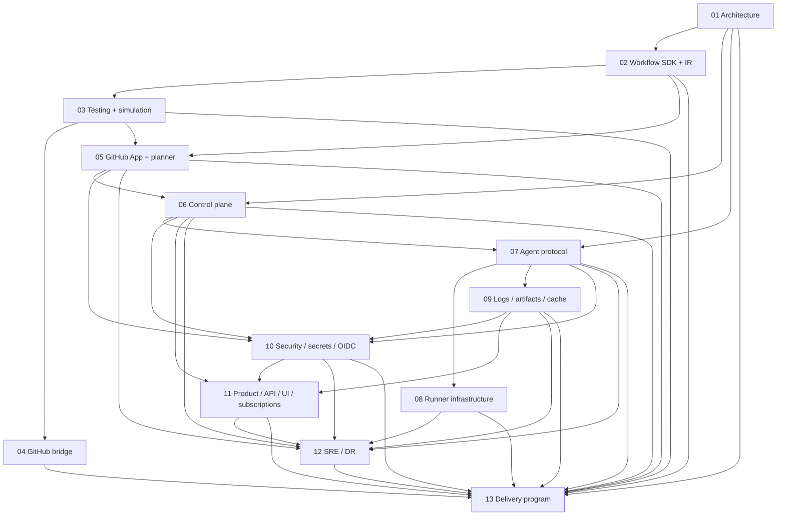

# bz CI detailed implementation plan

Status: proposed

Parent roadmap: [`../bz-ci-platform-roadmap.md`](../bz-ci-platform-roadmap.md)

Baseline: `dev/v2.0` at `65b5b2b`

## Purpose

This directory turns the product roadmap into an implementation program. Each plan defines the
interfaces, durable data, service responsibilities, build order, tests, rollout, and exit criteria
for one part of a complete bz CI service.

The plans deliberately separate decisions from implementation. Items marked **required** are
release requirements. Items marked **decision** require an ADR before dependent work begins.

All architecture, dependency, lifecycle, state-machine, and flow diagrams use Mermaid so GitHub
renders them and reviewers can update them as code. Plain text/code fences are reserved for literal
commands, file layouts, formulas, schemas, and protocol examples rather than diagrams.

## Complete-solution definition

The first complete solution is reached when a GitHub organization can:

1. Install the bz GitHub App and select repositories.
2. Commit a typed workflow definition and test it locally without invoking external commands.
3. Receive push, pull request, merge queue, schedule, API, and manual events reliably.
4. Plan workflow code at the exact commit in an untrusted sandbox.
5. Schedule a durable dependency graph across Linux x64 and ARM64 runners.
6. Execute jobs on customer-owned or bz-managed ephemeral runners.
7. Stream searchable logs and publish annotations and Checks to GitHub.
8. Share verified artifacts between jobs and use repository-scoped dependency caches.
9. Inject policy-authorized secrets and short-lived OIDC identities.
10. Cancel, time out, retry, approve, and rerun work with a complete audit trail.
11. Recover accepted work after service, queue, runner, or GitHub API failures.
12. Enforce quotas, retention, budgets, and tenant isolation.
13. Start, change, cancel, and recover a service subscription with explainable effective
    entitlements and reconciled usage invoices.

The service is not complete if the happy path works but these failure paths remain undefined.

## Plan index

| Order | Plan | Primary outcome |
| ---: | --- | --- |
| 1 | [`01-system-architecture.md`](01-system-architecture.md) | Stable boundaries, trust model, packages, services, and ADRs |
| 2 | [`02-workflow-sdk-and-ir.md`](02-workflow-sdk-and-ir.md) | Deterministic typed workflow plan consumed by every scheduler |
| 3 | [`03-testing-and-simulation.md`](03-testing-and-simulation.md) | Local proof of workflow behavior and edge cases |
| 4 | [`04-github-bridge-and-migration.md`](04-github-bridge-and-migration.md) | Low-risk adoption through existing GitHub Actions |
| 5 | [`05-github-app-and-planner.md`](05-github-app-and-planner.md) | Durable event ingestion, Checks, and safe planning |
| 6 | [`06-control-plane-and-scheduler.md`](06-control-plane-and-scheduler.md) | Durable DAG, attempts, leases, cancellation, and APIs |
| 7 | [`07-runner-agent-and-protocol.md`](07-runner-agent-and-protocol.md) | Versioned outbound-only execution protocol |
| 8 | [`08-runner-infrastructure.md`](08-runner-infrastructure.md) | Static, Kubernetes, customer VM, and managed runner pools |
| 9 | [`09-logs-artifacts-and-cache.md`](09-logs-artifacts-and-cache.md) | Durable execution data and secure cross-job transfer |
| 10 | [`10-security-secrets-and-oidc.md`](10-security-secrets-and-oidc.md) | Authorization, tenant isolation, secrets, identity, and audit |
| 11 | [`11-product-api-ui-and-billing.md`](11-product-api-ui-and-billing.md) | Live execution UI, service subscriptions, and commercial controls |
| 12 | [`12-platform-sre-and-disaster-recovery.md`](12-platform-sre-and-disaster-recovery.md) | Production infrastructure, SLOs, observability, and recovery |
| 13 | [`13-delivery-program.md`](13-delivery-program.md) | Team sequencing, issue breakdown, gates, and GA cutover |

## Dependency graph



Work may run in parallel after the shared contracts stabilize. It must not bypass a dependency by
inventing a private representation or duplicate state machine.

## Architectural invariants

Every implementation and review must preserve these invariants:

1. Repository code never executes in a trusted control-plane process.
2. PostgreSQL owns durable run, job, attempt, permission, and lease state.
3. Queues deliver work; they do not define whether work exists or completed.
4. Distributed job fields are deterministic and serializable.
5. Runner-local task code remains ordinary TypeScript and may use the existing bz APIs.
6. Every accepted external request has an idempotency key.
7. Every runner write is fenced by tenant, job, attempt, and active lease.
8. Every credential is short-lived and limited to one purpose.
9. A fork pull request is untrusted unless an explicit approval changes its trust state.
10. Logs are masked before leaving the runner, but masking is not treated as an authorization
    boundary.
11. Managed multi-tenant jobs use a VM or microVM isolation boundary, not only a process or shared
    container.
12. Retries create new attempts and never reopen terminal state.
13. Internal execution continues when GitHub Checks cannot be updated.
14. Local simulation and server scheduling share a conformance suite.
15. An upgrade supports the prior workflow IR and agent protocol during a documented transition.

## Proposed repository/package layout

The current package remains usable while platform code is separated by responsibility.

```text
packages/
  core/                    existing bz task engine and public task APIs
  workflow/                defineWorkflow, expressions, IR types and validation
  testing/                 memory runtime, fixtures, simulator and assertions
  protocol/                runner/control-plane wire types and compatibility
  github/                  GitHub context and GitHub Actions adapter
  cli/                     local run, plan, test, graph, remote and admin commands

services/
  api/                     public REST/SSE API and authorization
  event-gateway/           GitHub webhook verification and durable acknowledgement
  planner-controller/      creates and validates sandboxed planning attempts
  scheduler/               DAG readiness, matrices, policy and concurrency
  dispatcher/              transactional outbox and capability queue publication
  lease-controller/        runner claims, heartbeats, expiry and fencing
  check-projector/         GitHub Checks and status reconciliation
  log-gateway/             resumable log ingestion and live fanout
  retention-worker/        object and metadata lifecycle enforcement
  reconciler/              GitHub and internal state repair
  oidc-issuer/             short-lived workload identity

agents/
  bz-agent/                job execution agent
  kubernetes-controller/   BYOC job provisioning
  vm-controller/           customer or managed VM provisioning

infra/
  modules/                 reusable infrastructure modules
  environments/            development, staging and production compositions
```

This layout is a target, not a requirement for the first proof of concept. The first vertical
slice may remain in one workspace as long as boundaries and database ownership are explicit.

## Standard work-package template

Every implementation issue derived from these plans must contain:

- **Outcome**: observable behavior, not an internal activity.
- **Dependencies**: exact issues, schema versions, or ADRs required first.
- **Interfaces changed**: public API, event, database, protocol, CLI, or UI contract.
- **Security review**: trusted input, untrusted input, credentials, and tenant boundary.
- **Failure behavior**: timeout, retry, cancellation, duplication, and partial success.
- **Tests**: unit, contract, integration, end-to-end, or failure-injection coverage.
- **Telemetry**: metrics, structured events, trace spans, and audit events.
- **Rollout**: feature flag, migration, canary, rollback, and compatibility window.
- **Definition of done**: measurable conditions and documentation updates.

No work item is complete merely because its success path passes locally.

## Delivery lanes

### Lane 0: dogfood and promotion

- Capture the repository's real CI as fixtures and a parity manifest before SDK work diverges.
- Exercise each safe feature through a real beelzebub job in the next increment.
- Promote jobs through local, bridge-shadow, bridge-required, planner-shadow, native-shadow,
  native-required, and release-authority stages.
- Retain the last promoted tool version and generated GitHub workflow as the bootstrap/fallback.
- Own parity differences, dogfood exceptions, branch-protection changes, and monthly fallback drills.

Lane 0 begins immediately and consumes output from every other lane. A milestone is incomplete if
its corresponding DF0–DF9 stage in the [delivery program](13-delivery-program.md#dogfood-first-delivery-lane)
is not running on the default branch.

### Lane A: developer platform

- Workflow SDK and IR.
- Simulator and testing DSL.
- CLI and migration bridge.
- First-party task modules.

### Lane B: control plane

- GitHub App and event gateway.
- Planner controller and plan storage.
- Scheduler, queues, leases, APIs, and Checks projection.

### Lane C: execution plane

- Agent protocol and runtime.
- BYOC controllers.
- Managed images, VM provisioning, and autoscaling.

### Lane D: data and security

- Logs, artifacts, caches, secrets, OIDC, audit, retention, and policy.

### Lane E: product and operations

- UI, CLI remote experience, administration, billing, support, SLOs, deployment, and disaster
  recovery.

## Program-level release gates

### Prototype gate

- A deterministic workflow plan is produced locally.
- The simulator explains all job and matrix decisions.
- The generated GitHub bridge matches the repository's current topology.
- The real formatting job is scenario-tested and running as a non-required generated Check.

### Independent vertical-slice gate

- A GitHub push is durably accepted.
- Planning happens in an isolated job.
- One job is leased to a local agent.
- Logs stream to the service.
- A GitHub Check completes without invoking GitHub Actions.
- Every repository event is shadow-planned and one real low-risk job runs natively as non-required.

### BYOC alpha gate

- Static and Kubernetes agents pass the provider conformance suite.
- Fork PR, cancellation, lease loss, cache poisoning, and GitHub outage tests pass.
- Artifacts, cache, native secrets, audit, quotas, and retention operate end to end.
- One low-risk native repository Check is required with a timed, tested bridge fallback.

### Managed beta gate

- Every attempt gets an ephemeral VM and verified cleanup.
- Capacity, budgets, usage, and provider failure are visible and bounded.
- Thirty days of shadow or non-required daily use meet beta SLOs.
- The supported repository non-release topology runs natively with per-job promotion records.

### GA gate

- OIDC, billing, support operations, deletion, restore, and incident drills pass.
- External security assessment findings are resolved or explicitly accepted.
- Thirty days of required-check use meet GA SLOs.
- A tested fallback and rollback remain available.
- Protected publish/deploy/release authority passes DF9 or remains an explicit GA blocker.

## Change-control process

1. Record cross-cutting decisions as ADRs before implementation divergence begins.
2. Change schemas and protocols through versioned proposals with compatibility tests.
3. Update the relevant detailed plan when a decision changes scope or sequencing.
4. Link implementation PRs back to one work package and exit criterion.
5. Review security, failure behavior, telemetry, and operations with the feature—not afterward.
6. Update the delivery program weekly with achieved evidence, changed estimates, and open risks.
